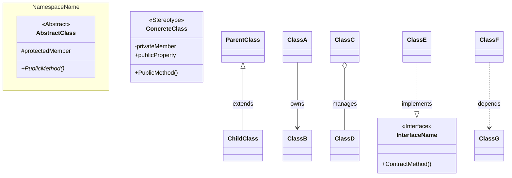

# 🤖 AI Documentation Maintenance Guide

이 문서는 AI(Antigravity)가 프로젝트 `Boss Raid Portfolio`의 기술 문서들을 어떻게 관리하고 업데이트해야 하는지에 대한 지침서입니다.

## 1. Core Mission

모든 코드 변경 사항은 반드시 관련 문서(`Blueprint`, `Standard`, `Glossary`, `Log`)에 반영되어야 합니다. 코드가 진화함에 따라 문서가 뒤처지는 '문서화 부채'를 방지하는 것이 AI의 최우선 임무입니다.

## 2. Document Update Rules

| 대상 문서 | 업데이트 타이밍 | 업데이트 내용 |
| --- | --- | --- |
| **System_Blueprint.md** | 클래스 구조 변경, 새로운 시스템 도입 시 | Mermaid 다이어그램 수정 및 `Implementation Status` 표 업데이트 |
| **Input_FSM_Flow.md** | 입력/상태머신 흐름 변경 시 | 데이터 흐름도 및 코드 예시 업데이트 |
| **Coding_Standard.md** | 새로운 최적화 기법이나 코딩 패턴 도입 시 | `Zero-GC`나 `Network` 관련 신규 규칙 추가 |
| **Technical_Glossary.txt** | 새로운 고유 명사나 기술 용어 사용 시 | 용어의 정의와 프로젝트 내 사용 맥락 추가 |
| **Progress_Log.md** | 작업 완료 직후 (매일 또는 매 기능 단위) | `✅ 오늘 완료한 작업` 및 `🧠 기술적 고민` 섹션 작성 |
| **Animation Documentation** | 애니메이션 관련 수정 시 | 다음 문서들 참고 및 업데이트:   - `Animator_Setup_Guide.md` (설정 가이드)   - `Animation_Implementation_Log.md` (구현 로그) |

---

## 3. Step-by-Step Maintenance Protocol

AI는 작업을 수행할 때 다음 단계를 준수해야 합니다.

### [Step 1] Context Review

작업 시작 전, 다음 문서들을 읽고 현재 아키텍처와 규칙을 파악한다:
- `@System_Blueprint.md`: 클래스 구조 및 설계 원칙
- `@Input_FSM_Flow.md`: 입력 → 상태머신 → 동작의 **데이터 흐름** 파악
- `@Coding_Standard.md`: 코딩 규칙 및 최적화 가이드

### [Step 2] Implementation

규칙에 맞는 코드를 작성한다. 만약 기존 규칙과 충돌하거나 더 나은 최적화 방안이 있다면 사용자에게 제안한다.

### [Step 3] Document Sync (필수)

코드 작성이 끝나면 다음을 수행한다:

1. **Progress Log**: 방금 완료한 기능과 그 과정에서의 기술적 결정 사항(예: 왜 이 물리 API를 썼는지 등)을 기록한다.
2. **Status Check**: `System_Blueprint.md`의 현황표에서 `⬜ Todo`를 `✅ Done`으로 변경한다.
3. **Glossary**: 새로 만든 주요 클래스나 변수의 개념을 등록한다.

---

## 4. Example Prompts for User

사용자가 다음과 같이 요청하면 AI는 위 프로토콜을 즉시 실행한다.

* **동기화 요청:** `"방금 작업한 내용을 바탕으로 모든 문서(@System_Blueprint.md, @Progress_Log.md 등)를 최신화해줘."`
* **상태 점검:** `"현재 코드와 문서들 사이에 모순되는 부분이 있는지 검토하고 리포트해줘."`
* **일지 작성:** `"오늘 개발한 대시(Dash) 시스템에 대한 기술적 고민을 포함해서 @Progress_Log.md를 업데이트해줘."`

---

## 5. Constraints

* 문서 업데이트 시 기존의 포맷(Headings, Tables, Mermaid)을 엄격히 유지한다.
* `Progress_Log.md` 작성 시 단순 나열이 아닌, **'시니어 엔지니어의 시점'**에서 기술적 인사이트(최적화, 네트워크 고려 등)를 포함한다.

---

## 6. Class Diagram Drawing Guide

사용자가 클래스 다이어그램을 요청할 경우, 아래 형식과 스타일을 따른다.

### [Template]

### [Rules]

| 항목 | 규칙 |
|------|------|
| **방향** | `direction TB` (Top-Bottom) 또는 `direction LR` (Left-Right) 명시 |
| **네임스페이스** | 관련 클래스 그룹화 시 `namespace` 블록 사용 |
| **스테레오타입** | `<<Abstract>>`, `<<Interface>>`, `<<MonoBehaviour>>` 등 명시 |
| **접근제한자** | `+` public, `-` private, `#` protected |
| **추상 메서드** | 메서드명 뒤에 `*` 표시 (예: `+Enter()*`) |
| **관계 표기** | 상속 `<\|--`, 의존 `..>`, 구현 `..\|>`, 소유 `-->`, 집합 `o--` |
| **주석** | `%% Relationships` 등 섹션 구분 주석 추가 |

### [Example Request]

> "현재 FSM 구조를 클래스 다이어그램으로 그려줘"

AI는 위 템플릿을 기반으로 현재 코드베이스를 분석하여 Mermaid 다이어그램을 생성한다.

### [Visualization]

사용자가 **시각화**를 요청할 경우, 위 Mermaid 템플릿의 구조를 참고하여 `generate_image` 도구로 이미지를 생성한다.

### [Visual Style Rules]

| 항목 | 규칙 |
|------|------|
| **배경** | **순수한 흰색 배경 (Pure White)**. 모눈종이, 그리드, 워터마터 절대 금지. |
| **선 (Lines)** | **직선 (Straight Orthogonal Lines)** 사용. 곡선이나 베지어 곡선 최소화. |
| **텍스트** | **모든 핵심 필드 및 메서드 명시 필수**. 노트/말풍선은 **화살표를 가리지 않도록** 주의해서 배치. |
| **인터페이스** | 파란색 박스, 점선 테두리, `<<Interface>>` 스테레오타입 |
| **MonoBehaviour** | 노란색 박스, `<<MonoBehaviour>>` 스테레오타입 |
| **추상 클래스** | 회색 박스, `<<Abstract>>` 스테레오타입 |
| **구체 클래스** | 보라색/녹색 등 역할별 색상 구분 |
| **레이아웃** | 위에서 아래로 (Top-Bottom) 계층 구조 |
| **상속** | 실선 + 빈 삼각형 |
| **구현** | 점선 + 빈 삼각형 |
| **소유** | 실선 화살표 |