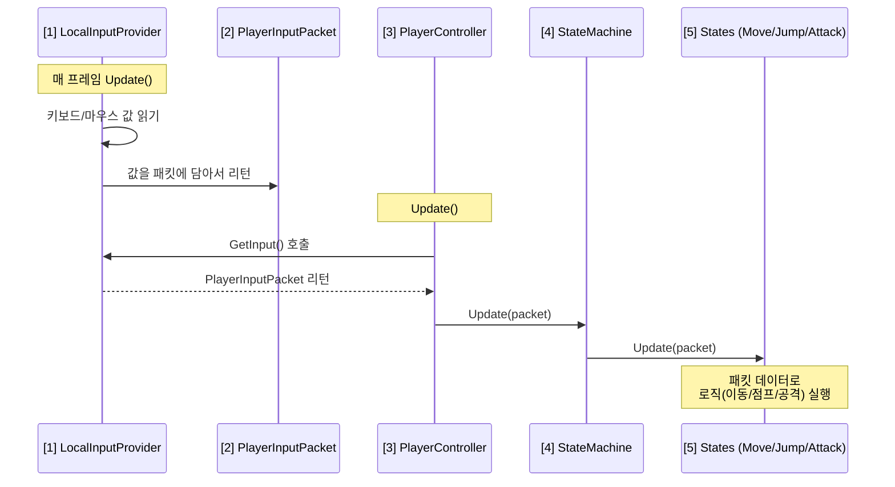

# 🔄 Input System & FSM Data Flow

플레이어 입력이 어떻게 캐릭터 동작으로 이어지는지 설명합니다.

---

## 데이터 흐름도



---

## 1. PlayerInputPacket (데이터 택배상자)

```csharp
// PlayerInputData.cs
public struct PlayerInputPacket {
    public Vector2 moveDir;   // WASD 입력 방향
    public float lookYaw;     // 마우스 좌우 (Y축 회전)
    public float lookPitch;   // 마우스 위아래 (X축 회전)
    public byte buttons;      // 대시/공격 버튼 (비트로 압축)
}
```

| 특징 | 설명 |
|------|------|
| `struct` 사용 | GC 발생 안 함, 매 프레임 생성해도 성능 OK |
| `byte buttons` | 비트 연산으로 8개 버튼을 1바이트에 압축 |

---

## 2. LocalInputProvider (입력 수집기)

```csharp
public PlayerInputPacket GetInput() {
    PlayerInputPacket packet = new PlayerInputPacket();
    packet.moveDir = _inputActions.Player.Move.ReadValue<Vector2>().normalized;
    packet.lookYaw = _currentYaw;
    packet.lookPitch = _currentPitch;
    packet.SetFlag(InputFlag.Dash, _inputActions.Player.Dash.IsPressed());
    return packet;
}
```

- **역할**: 유니티 Input System에서 실시간 입력을 읽고 `PlayerInputPacket`에 포장
- **확장성**: 나중에 `NetworkInputProvider`로 교체하면 네트워크 입력도 같은 방식으로 처리 가능

---

## 3. PlayerController (중앙 관제탑)

```csharp
private void Update() {
    PlayerInputPacket input = _inputProvider.GetInput();
    cameraRoot.rotation = Quaternion.Euler(input.lookPitch, input.lookYaw, 0f);
    _stateMachine.Update(input);
}
```

- **카메라 회전**: 공통 동작이므로 직접 처리
- **나머지 로직**: StateMachine에게 위임

---

## 4. StateMachine (교통정리)

```csharp
public void Update(PlayerInputPacket input) {
    _currentState?.Update(input);
}

public void ChangeState(BaseState newState) {
    _currentState?.Exit();
    _currentState = newState;
    _currentState?.Enter();
}
```

- "지금 뭐하는 중인지" 기억하고, 해당 상태의 로직만 실행

---

## 5. States (Move, Jump, Dash, Attack)

```csharp
// MoveState.cs
public override void Update(PlayerInputPacket input) {
    UpdateRotation(input);  // input.moveDir 사용
    
    if (input.HasFlag(InputFlag.Dash)) {
        Controller.StateMachine.ChangeState(Controller.DashState);
    }
}
```

---

## 요약 테이블

| 순서 | 파일 | 역할 |
|------|------|------|
| 1 | `LocalInputProvider` | 키보드/마우스 값 → `PlayerInputPacket` 생성 |
| 2 | `PlayerController` | 패킷 받아서 카메라 회전 + StateMachine 호출 |
| 3 | `StateMachine` | 현재 상태의 `Update(packet)` 실행 |
| 4 | `Move` / `Jump` / `Attack` | 패킷 데이터로 실제 이동/점프/공격 처리 |

---

## 6. State Transition Pipeline (Deep Dive)
상태 전환(`ChangeState`) 시 발생하는 실행 흐름의 동기적 특성을 설명합니다.

### 상태 전환의 2단계 프로세스

#### [1단계] Frame N: 동기적 교체 (Synchronous Swap)
1. `ChangeState(NewState)` 호출.
2. `OldState.Exit()` -> `_currentState = NewState` -> `NewState.Enter()` 순차 실행.
3. **중요**: 함수 호출이 종료되면 실행 흐름은 `ChangeState`를 호출했던 지점의 **다음 줄**로 돌아와 남은 코드를 마저 실행함.

#### [2단계] Frame N+1: 새로운 로직 시작 (New Logic)
1. 다음 프레임의 `Update()` 루프에서 `_currentState.Update()` 호출.
2. 이제 `_currentState`가 `NewState`를 가리키고 있으므로, 새로운 상태의 로직만 실행됨.

> **결론**: 상태 변수 교체는 즉각적(Sync)이지만, 해당 상태의 반복 로직(`Update`)은 다음 프레임부터 실행됨.

