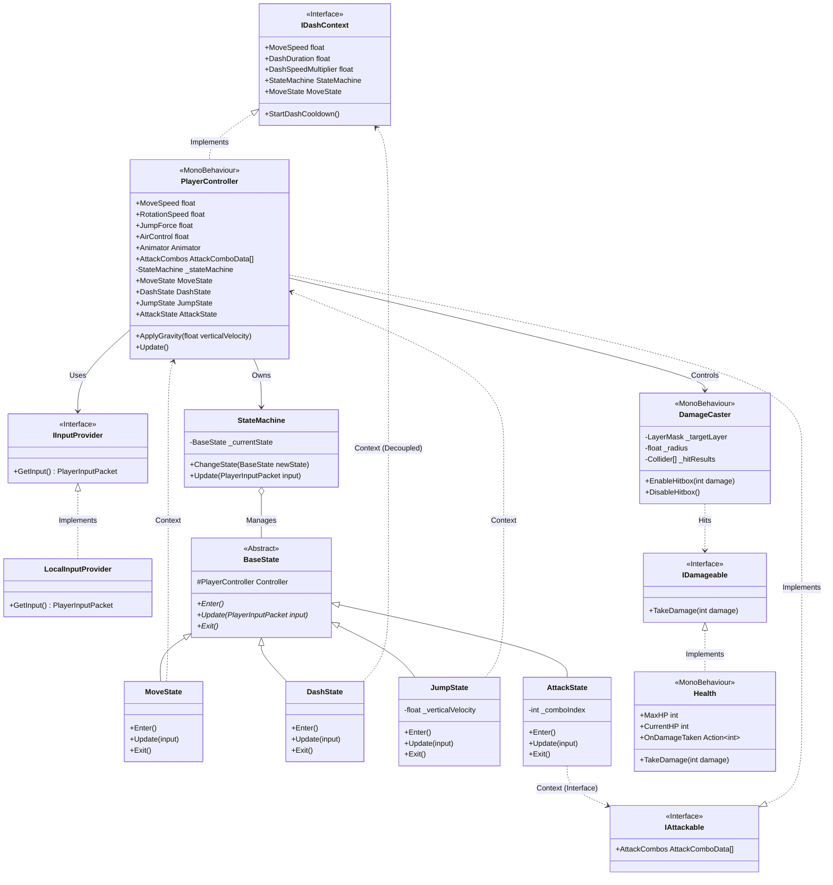

### 📄 [File Content] `System_Blueprint.md`

```markdown
# 🛠️ System Blueprint: Boss Raid Portfolio

이 문서는 프로젝트의 핵심 아키텍처 설계와 데이터 규칙을 정의합니다. AI 및 개발자는 이 청사진을 준수하여 코드를 작성해야 합니다.

## 1. Core Architecture Philosophy
* **Decoupling (탈응집)**: 입력(Provider) → 해석(Controller) → 행동(State)의 단방향 의존성 유지.
* **Network-Ready Data**: 로직에는 `bool`이나 `Input` 클래스를 직접 사용하지 않고, 반드시 직렬화 가능한 `PlayerInputPacket` 구조체만 전달한다.
* **Zero-GC**: `Update` 루프 내에서의 메모리 할당(new)을 금지하며, 구조체(Struct)와 NonAlloc 물리 API를 사용한다.

---

## 2. Technical Class Diagram (Target Architecture)
현재 `PlayerController`에 작성된 이동 로직을 `StateMachine`으로 이관하는 것이 목표 구조입니다.



---

## 3. Data Rules & Coding Standards

### [Input System]

* **Packet Structure**: `PlayerInputData.cs`에 정의된 `PlayerInputPacket`을 사용한다.
* **Bit-Masking**: 버튼 입력은 `bool` 필드를 늘리지 않고 `InputFlag` 열거형과 비트 연산(`|`, `&`, `~`)을 통해 `byte buttons` 필드 하나로 처리한다.
* *Example*: `if (input.HasFlag(InputFlag.Dash)) ...`


### [Physics & Movement]

* **Rotation Logic**:
* `lookYaw`, `lookPitch`: **CameraRoot** 회전용 (마우스 입력).
* `moveDir`: **Character Body** 회전 및 이동용 (키보드 입력).
* 캐릭터 몸통은 카메라가 바라보는 방향(`cameraRoot.forward`)을 기준으로 이동 벡터를 변환해야 한다.


* **Optimization**:
* 물리 판정 시 `Physics.OverlapSphere` 금지 → **`Physics.OverlapSphereNonAlloc`** 사용.
* 모든 물리 쿼리 결과 배열(`Collider[]`)은 클래스 멤버 변수로 미리 할당(Pre-allocate)하여 재사용한다.


### [FSM Implementation Guide]

* **Role of Controller**: `PlayerController`는 `CharacterController.Move()`와 같은 실제 물리 실행 메서드만 `public`으로 열어두고, '어떻게' 움직일지 결정하는 로직은 `State` 클래스에 위임한다.
* **State Transition**: 상태 전환은 `StateMachine.ChangeState()`를 통해서만 이루어져야 한다.

---

## 4. Implementation Status Check (Antigravity Context)

| Component | Status | Note |
| --- | --- | --- |
| **IInputProvider** | ✅ Done | `LocalInputProvider.cs` 구현 완료. |
| **Input Packet** | ✅ Done | `PlayerInputPacket` (Bit-packing) 적용 완료. |
| **Camera Logic** | ✅ Done | CameraRoot 분리 및 로컬 회전 구현 완료. |
| **StateMachine** | ✅ Done | `BossRaid.Patterns` 네임스페이스 적용 및 구현 완료. |
| **Movement Logic** | ✅ Done | `MoveState`로 로직 이관 완료. |
| **Dash Logic** | ✅ Done | Cooldown 및 Edge-triggering 기능 포함 구현 완료. |
| **Jump Logic** | ✅ Done | `JumpState` 구현 완료. 공중 이동/대시 지원. |
| **Attack Logic** | ✅ Done | `AttackState` 구현 완료. 콤보/캔슬/개별 데미지 지원. |
| **Asset Integration** | 🔄 In Progress | FSM-Animator 연동 코드 완료. Unity 에디터 설정 진행 중. |
| **Hit/Damage System** | ✅ Done | `IDamageable`, `DamageCaster`, `Health` 구현 완료. |
| **Physics System** | ✅ Done | `NonAlloc` 물리 판정(OverlapSphere) 및 최적화 완료. |
| **Boss AI (The Cube)** | ⬜ Todo | FSM 기반 추적/돌격/투사체 패턴 구현. |
| **Object Pooling** | ⬜ Todo | 투사체/VFX Zero-Allocation 관리. |
| **Game Loop** | ⬜ Todo | 게임 매니저, 승리/패배 흐름 제어. |
| **Netcode Prep** | ⬜ Todo | 추후 `NetworkInputProvider` 추가 예정. |

---

### 💡 Antigravity Prompting Guide

이 파일을 기반으로 AI에게 작업을 지시할 때 다음과 같이 요청하세요:

> "System_Blueprint.md의 **FSM Layer** 섹션을 참고해서, 현재 `PlayerController.cs`에 있는 이동 로직을 추출하여 `MoveState` 클래스를 작성하고, `PlayerController`에는 상태 머신을 연결해줘."

```