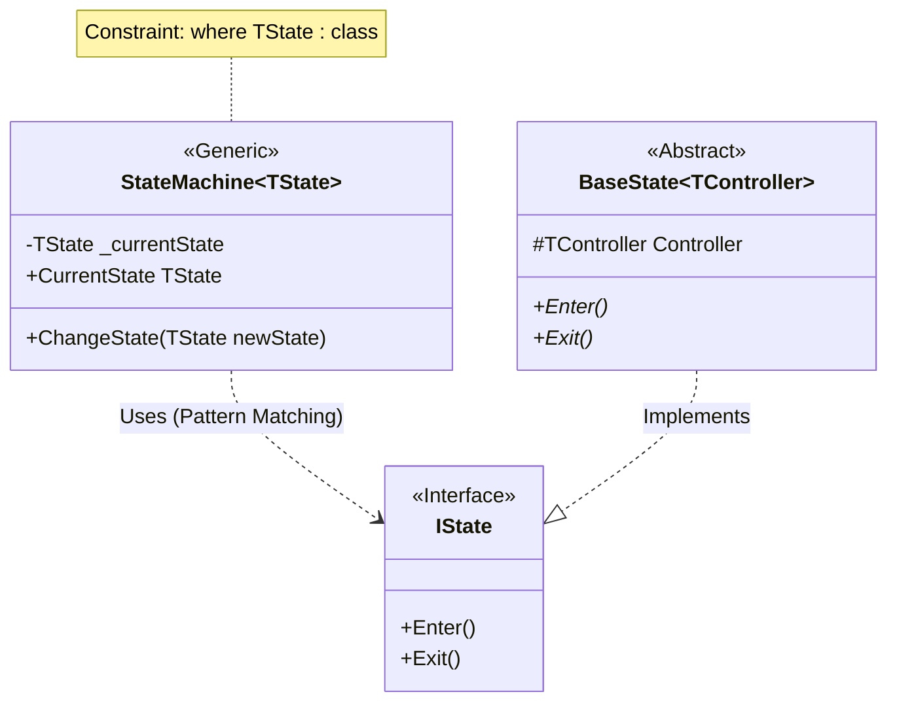
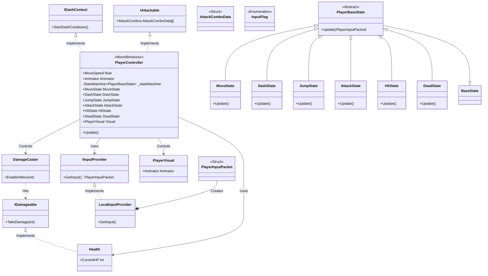
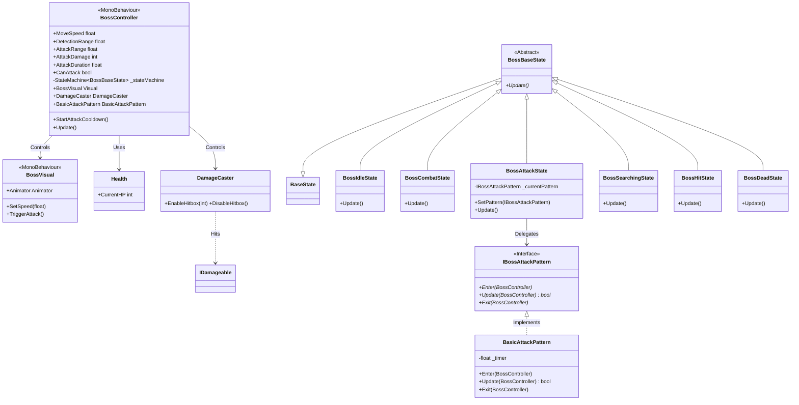

### 📄 [File Content] `System_Blueprint.md`

```markdown
# 🛠️ System Blueprint: Boss Raid Portfolio

이 문서는 프로젝트의 핵심 아키텍처 설계와 데이터 규칙을 정의합니다. AI 및 개발자는 이 청사진을 준수하여 코드를 작성해야 합니다.

## 1. Core Architecture Philosophy
* **Decoupling (탈응집)**: 입력(Provider) → 해석(Controller) → 행동(State)의 단방향 의존성 유지.
* **Network-Ready Data**: 로직에는 `bool`이나 `Input` 클래스를 직접 사용하지 않고, 반드시 직렬화 가능한 `PlayerInputPacket` 구조체만 전달한다.
* **Zero-GC**: `Update` 루프 내에서의 메모리 할당(new)을 금지하며, 구조체(Struct)와 NonAlloc 물리 API를 사용한다.

---

## 2. Technical Class Diagram (Implemented Architecture)
본 프로젝트는 `StateMachine` 패턴을 기반으로 Player와 Boss의 로직을 제어합니다. 아래 다이어그램은 현재 구현된 아키텍처를 나타냅니다.

### 2.1. Core FSM Architecture (Generic Core)
`StateMachine<TState>`는 특정 상태 타입(`TState`)을 관리하며, 상태 전환 시 `IState` 인터페이스를 통해 `Enter/Exit`을 호출합니다.

**관련 코드:**
*   `Assets/Scripts/Patterns/StateMachine.cs`: `TState : class` 제약 조건 및 `is IState` 패턴 매칭 사용.
*   `Assets/Scripts/Patterns/BaseState.cs`: `IState` 구현 및 `TController` 보유.
*   `Assets/Scripts/Patterns/IState.cs`: 공통 인터페이스.



### 2.2. Player System Architecture (The Capsule)
입력 처리부터 상태 전환, 전투 로직까지의 플레이어 전용 구조입니다.

**관련 코드:**
*   **Controller**: `Assets/Scripts/PlayerController.cs` (`IDashContext`, `IAttackable` 구현)
*   **Input**: `Assets/Scripts/LocalInputProvider.cs`, `Assets/Scripts/PlayerInputData.cs`
*   **Visual**: `Assets/Scripts/Player/PlayerVisual.cs`
*   **Combat Data**: `Assets/Scripts/Player/AttackComboData.cs`
*   **Combat Components**: `Assets/Scripts/Combat/` (`Health.cs`, `DamageCaster.cs`)
*   **States**:
    - `Assets/Scripts/Player/States/`: `MoveState.cs`, `DashState.cs`, `JumpState.cs`, `AttackState.cs`
    - `Assets/Scripts/Patterns/`: `HitState.cs`, `DeadState.cs` (플레이어 전용이지만 Patterns 네임스페이스 사용)
*   **Interfaces**: `Assets/Scripts/Interfaces/` (`IInputProvider`, `IDashContext`, `IAttackable`)



### 2.3. Boss AI Architecture (The Cube)
거리 기반 상태 전환과 비주얼 분리(BossVisual)가 적용된 보스 전용 구조입니다.

**관련 코드:**
*   **Controller**: `Assets/Scripts/Boss/BossController.cs`
*   **Visual**: `Assets/Scripts/Boss/BossVisual.cs`
*   **States**: `Assets/Scripts/Boss/BossFSM.cs` (모든 Boss State 클래스 포함)
*   **Attack Patterns**: `Assets/Scripts/Boss/Attacks/` (`IBossAttackPattern.cs`, `BasicAttackPattern.cs`)
*   **Combat**: `Assets/Scripts/Common/Combat/Health.cs`, `Assets/Scripts/Common/Combat/DamageCaster.cs`



---

## 3. Data Rules & Coding Standards

### [Input System]

* **Packet Structure**: `PlayerInputData.cs`에 정의된 `PlayerInputPacket`을 사용한다.
* **Bit-Masking**: 버튼 입력은 `bool` 필드를 늘리지 않고 `InputFlag` 열거형과 비트 연산(`|`, `&`, `~`)을 통해 `byte buttons` 필드 하나로 처리한다.
* *Example*: `if (input.HasFlag(InputFlag.Dash)) ...`


### [Physics & Movement]

* **Rotation Logic**:
* `lookYaw`, `lookPitch`: **CameraRoot** 회전용 (마우스 입력).
* `moveDir`: **Character Body** 회전 및 이동용 (키보드 입력).
* 캐릭터 몸통은 카메라가 바라보는 방향(`cameraRoot.forward`)을 기준으로 이동 벡터를 변환해야 한다.


* **Optimization**:
* 물리 판정 시 `Physics.OverlapSphere` 금지 → **`Physics.OverlapSphereNonAlloc`** 사용.
* 모든 물리 쿼리 결과 배열(`Collider[]`)은 클래스 멤버 변수로 미리 할당(Pre-allocate)하여 재사용한다.


### [FSM Implementation Guide]

* **Role of Controller**: `PlayerController`는 `CharacterController.Move()`와 같은 실제 물리 실행 메서드만 `public`으로 열어두고, '어떻게' 움직일지 결정하는 로직은 `State` 클래스에 위임한다.
* **State Transition**: 상태 전환은 `StateMachine.ChangeState()`를 통해서만 이루어져야 한다.

---

## 4. Implementation Status Check (Antigravity Context)

| Component | Status | Note |
| --- | --- | --- |
| **IInputProvider** | ✅ Done | `LocalInputProvider.cs` 구현 완료. |
| **Input Packet** | ✅ Done | `PlayerInputPacket` (Bit-packing) 적용 완료. |
| **Camera Logic** | ✅ Done | CameraRoot 분리 및 로컬 회전 구현 완료. |
| **StateMachine** | ✅ Done | `BossRaid.Patterns` 네임스페이스 적용 및 구현 완료. |
| **Movement Logic** | ✅ Done | `MoveState`로 로직 이관 완료. |
| **Dash Logic** | ✅ Done | Cooldown 및 Edge-triggering 기능 포함 구현 완료. |
| **Jump Logic** | ✅ Done | `JumpState` 구현 완료. 공중 이동/대시 지원. |
| **Attack Logic** | ✅ Done | `AttackState` 구현 완료. 콤보/캔슬/개별 데미지 지원. |
| **Asset Integration** | ✅ Done | FSM-Animator 연동 코드 완료. Unity 에디터 설정 완료. |
| **Hit/Damage System** | ✅ Done | `IDamageable`, `DamageCaster`, `Health` 구현 완료. |
| **Physics System** | ✅ Done | `NonAlloc` 물리 판정(OverlapSphere) 및 최적화 완료. |
| **Boss AI (The Cube)** | 🔄 In Progress | FSM 기반 추적(Pattern 1) + 근접 공격(BasicAttackPattern) 구현 완료. Strategy Pattern 적용. 돌격/투사체 예정. |
| **Player Hit/Death** | ✅ Done | HitState(중력+무적), DeadState(코루틴 정리), CrossFade 애니메이션 적용 완료. |
| **Object Pooling** | ⬜ Todo | 투사체/VFX Zero-Allocation 관리. |
| **Game Loop** | ⬜ Todo | 게임 매니저, 승리/패배 흐름 제어. |
| **Netcode Prep** | ⬜ Todo | 추후 `NetworkInputProvider` 추가 예정. |

---

### 💡 Antigravity Prompting Guide
1. **테스트 주도 지시 (TDD-ish)**: AI에게 구현을 맡기기 전, 기능의 정상 작동 여부를 확인하기 위한 테스트 조건을 우선 정의하도록 요구한다. 이를 통해 결과물 검증 기준을 명확히 한다.

    > **예시)**
    > "지금부터 [기능 이름]을 구현한다. 구현에 앞서 다음 사항을 먼저 수행하라.
    >
    > 1. 기능의 정상 작동을 확인하기 위한 **성공 조건(Success Criteria) 3가지**를 정의한다.
    > 2. 발생 가능한 **예외 상황(Edge Case)** 및 논리적 오류 2가지를 예측한다.
    >
    > 위 조건들을 확인한 뒤 승인을 받으면 코드를 작성한다."

2. **모듈화의 극대화**: 모든 기능을 한 번에 구현하도록 지시하지 않고, 기능을 최소 단위로 세분화하여 요청한다. 이는 유지보수 용이성을 높이고 AI의 논리적 오류를 최소화한다.

3. **문서의 버전 관리**: 시스템 설계 문서가 업데이트될 때마다 변경 사항을 기록한다. 이는 프로젝트 규모 확장 시 발생할 수 있는 논리적 충돌을 추적하는 데 용이하다.