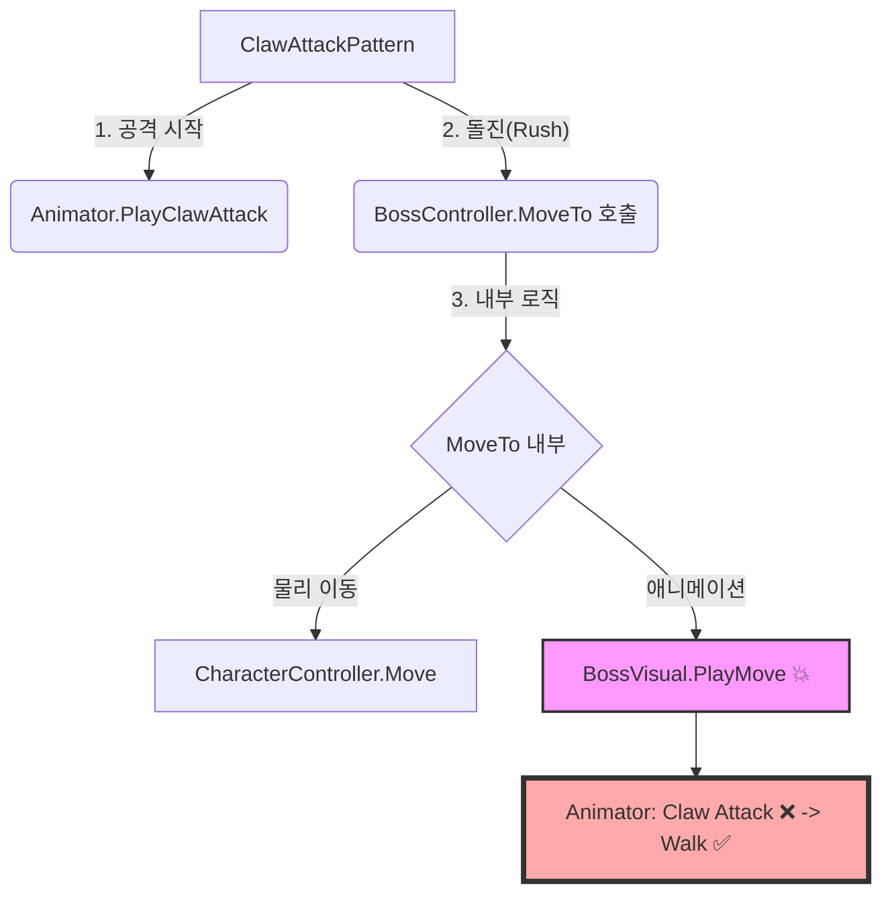
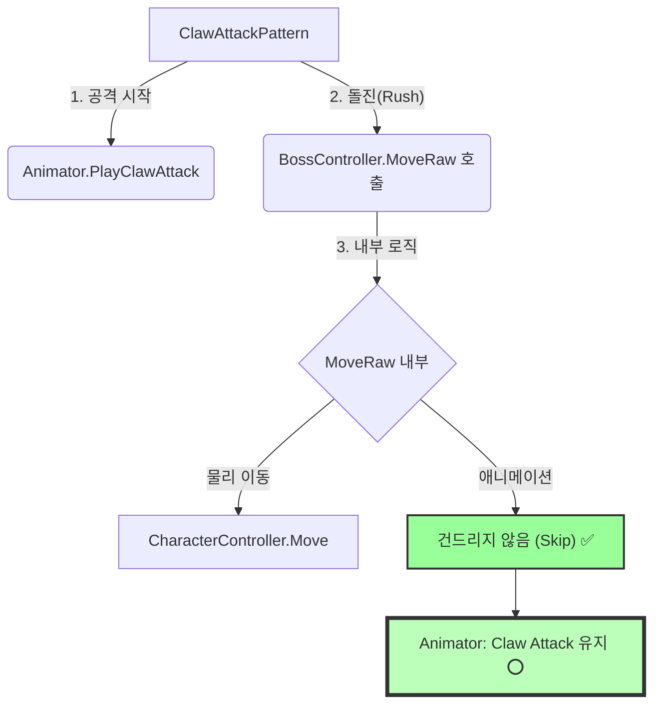

# 🐛 [개발일지] 공격하다 말고 걷는 보스? - 애니메이션과 로직의 충돌

> **작성일**: 2026-02-12  
> **주제**: FSM 기반 보스 AI에서 애니메이션 상태와 이동 로직의 충돌 해결 (Animation Override Issue)

---

## 1. 문제 상황: "왜 때리다 말아요?"

보스의 신규 패턴 **`Claw Attack` (할퀴기)** 을 구현하던 중 심각한 버그를 발견했다.  
보스가 팔을 들어 올리며 공격을 준비하다가, **갑자기 걷기(Walk) 모션으로 뚝 끊기면서 앞으로 미끄러지는 현상**이 발생했다.

마치 공격을 하려다 말고 산책을 나가는 것처럼 보였다.

### 🔍 디버깅 로그

```text
[Boss] ClawAttackPattern.Enter() -> Animator: ClawAttack
[Boss] ClawAttackPattern.Update() -> Rush Phase Start
[Boss] Animator State Changed: ClawAttack -> Move (Why?)
```

로그를 확인해보니, 분명 `ClawAttack` 애니메이션을 재생하라고 명령했는데, 불과 몇 프레임 뒤에 `Move` 상태로 강제 전환되고 있었다.

---

## 2. 원인 분석: 과도한 친절이 불러온 참사

원인은 `BossController`의 **`MoveTo` 메서드**에 있었다.  
이 메서드는 보스가 플레이어를 추적할 때 사용하려고 만들었는데, "이동하면 당연히 걷는 모션이 나와야지"라는 생각으로 애니메이션 재생 코드까지 포함시켜 둔 것이 화근이었다.

### As-Is: 기존 코드

```csharp
// BossController.cs

public void MoveTo(Vector3 targetPosition, float speed)
{
    // 1. 물리 이동 (CharacterController)
    Vector3 direction = (targetPosition - transform.position).normalized;
    direction.y = 0;
    _characterController.Move(direction * speed * Time.deltaTime);

    // 2. 애니메이션 강제 변경 (💥 문제의 원인)
    if (animator)
    {
        // "이동 함수를 호출했다" == "걷는 중이다"로 간주해버림
        animator.PlayMove(); // Claw Attack 재생 중인데 Move로 덮어씌움!
        animator.SetSpeed(speed);
    }
}
```

**`ClawAttackPattern`** 에서는 공격 도중 앞으로 돌진(Rush)하기 위해 `MoveTo`를 호출했다. 그러자 `MoveTo` 내부에 숨어있던 `animator.PlayMove()`가 실행되면서, **힘겹게 재생한 공격 모션을 걷기 모션으로 덮어버린 것**이다.

### 💥 실행 흐름 (충돌 발생)



---

## 3. 해결책: 책임의 분리 (Separation of Concerns)

해결 방법은 간단했다. **"이동(Move)"과 "애니메이션(Animate)"의 책임을 분리**하는 것이다.

1.  **`MoveTo`**: 추적용. 이동하면서 애니메이션도 바꿈 (기존 유지).
2.  **`MoveRaw` (신규)**: 공격용. **오직 물리적인 위치만 옮김.** 애니메이션은 건드리지 않음.

### To-Be: 개선 코드

```csharp
// BossController.cs

// ✅ 신규 메서드: 순수 물리 이동
public void MoveRaw(Vector3 direction, float speed)
{
    direction.y = 0;
    if (direction != Vector3.zero)
    {
        // 애니메이션 코드 없음! 오직 위치만 변경
        _characterController.Move(direction.normalized * speed * Time.deltaTime);
    }
}
```

### 패턴 코드 적용 (ClawAttackPattern.cs)

```csharp
// ClawAttackPattern.cs

// [돌진 구간]
if (IsRushing)
{
    // MoveTo 대신 MoveRaw 사용 -> 현재 재생 중인 공격 애니메이션 유지됨
    controller.MoveRaw(controller.transform.forward, _rushSpeed);
}
```

---

## 4. 결과 및 교훈

### ✅ 개선된 흐름



이제 보스는 **"팔을 크게 휘두르는 모션(Claw Attack)"을 유지한 채로** 플레이어를 향해 미끄러지듯 돌진한다.

### 💡 교훈 (Retrospective)

*   **Helper 함수의 함정**: 편의를 위해 만든 함수(`MoveTo`)가 너무 많은 일(이동+애니+회전)을 하면, 다른 상황에서 재사용하기 어렵다.
*   **SR (단일 책임 원칙)**: "이동한다"와 "걷는 모션을 취한다"는 엄연히 다른 동작이다. 이를 묶어두면 이번처럼 "공격 모션으로 이동하고 싶은" 경우에 대응할 수 없다.
*   **기능 분해**: `MoveRaw`처럼 가장 기본적이고 원자적인(Atomic) 기능을 노출해두어야 FSM의 다양한 상태에서 유연하게 조립해서 사용할 수 있다.
