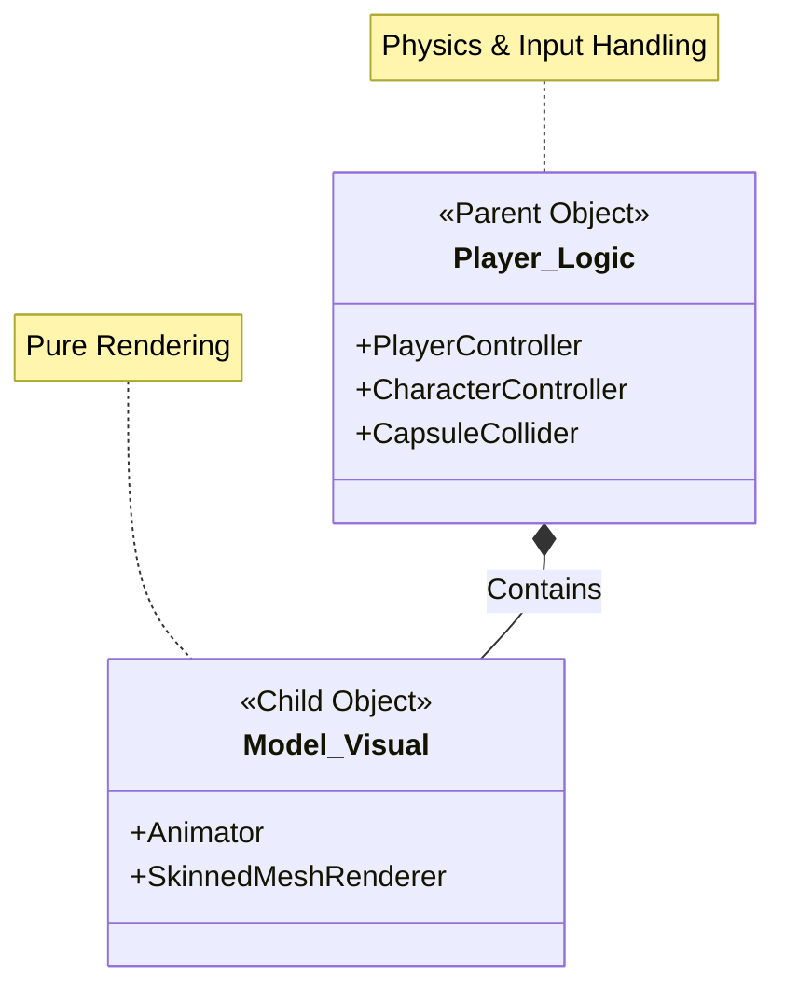

# [Portfolio] Boss Raid Portfolio: 코드 주도형 애니메이션 아키텍처 (Code-Driven Animation)

## 1. 개요 (Introduction)

Unity에서 애니메이션을 다룰 때 가장 흔한 방식은 Animator Controller의 복잡한 Transition(화살표)에 의존하는 것이다. 하지만 이는 프로젝트 규모가 커질수록 **스파게티 상태머신**을 유발하여 유지보수를 어렵게 만든다.

본 프로젝트에서는 로직과 비주얼을 철저히 분리하고, **C# 코드가 애니메이션 상태를 강제로 결정**하는 **Code-Driven Animation Architecture**를 도입했다.

---

## 2. 아키텍처: Logic vs Visual의 철저한 분리

캐릭터의 본체(Physics)와 껍데기(Visual)를 분리하여, 로직의 독립성을 확보했다.

*   **Logic (Parent):** `PlayerController`, `CharacterController`. 물리 연산과 FSM 로직을 담당하는 투명한 'Ghost'이다.
*   **Visual (Child):** `Animator`, `3D Mesh`. 로직이 시키는 대로 렌더링만 수행하는 'Skin'이다.



이 구조 덕분에 아티스트가 모델을 변경해도 로직 코드는 전혀 수정할 필요가 없다.

---

## 3. 핵심: Transitionless Animator (화살표 없는 애니메이터)

### 기존 방식의 문제점
기존에는 `Idle` ↔ `Run` ↔ `Attack` 사이의 모든 조건을 Animator 창에서 화살표(Transition)로 연결하고 `bool isRunning` 같은 파라미터를 관리해야 했다. 이는 FSM 코드의 흐름과 Animator의 흐름이 이중으로 존재하여 **버그의 온상**이 된다.

### 해결책: `CrossFade`를 통한 코드 주도 제어
우리는 Animator의 판단을 배제하고, **C# FSM(Finite State Machine)이 모든 권한**을 가진다.

1.  **화살표 제거:** Animator에는 State만 존재하고 Transition은 없다.
2.  **명령 하달:** FSM의 `Enter()`가 실행되는 순간, 코드가 `CrossFade` 명령을 내린다.

#### 코드 예시: 공격 로직

```csharp
// AttackState.cs
public override void Enter()
{
    // "이전 상태가 뭐였든 상관없다. 즉시 공격 모션으로 전환하라."
    // 애니메이터의 전이 조건을 무시하고 코드의 명령이 우선됨.
    Controller.Animator.CrossFade(PlayerController.ANIM_STATE_ATTACK1, 0.1f);
}
```

#### 코드 예시: 이동 복귀

```csharp
// MoveState.cs
public override void Enter()
{
    // 공격이 끝나고 이동 상태로 돌아왔을 때, 다시 Locomotion으로 섞어줌
    Controller.Animator.CrossFade(PlayerController.ANIM_STATE_LOCOMOTION, 0.1f);
}
```

---

## 4. 개념도: Transition은 어디 갔는가?

애니메이터 창에서 사라진 화살표는 **C# 코드의 상태 전환(State Transition) 그 자체**가 되었다.

| C# State Change | Animation Transition | 비고 |
| :--- | :--- | :--- |
| `Move` ➔ `Attack` | **Locomotion** ➔ **Attack1** | 공격 버튼 입력 시 즉시 전환 |
| `Attack` ➔ `Move` | **Attack1** ➔ **Locomotion** | 공격 애니메이션 종료 후 복귀 |
| `Move` ➔ `Jump` | **Locomotion** ➔ **Jump** | 점프 버튼 입력 시 전환 |

이렇게 함으로써 **코드가 곧 애니메이션의 상태**라는 단일 진실 공급원(Single Source of Truth) 원칙을 지킬 수 있다.

---

## 5. 결론 및 성과

이 방식을 통해 다음과 같은 이점을 얻었다.

1.  **유지보수성:** 애니메이터 창을 열지 않고도 C# 코드만으로 상태 흐름을 완벽히 파악하고 수정할 수 있다.
2.  **확장성:** 콤보 공격이나 스킬이 수십 개 늘어나도, 애니메이터에 화살표를 연결하는 노가다 없이 `CrossFade` 한 줄이면 추가가 끝난다.
3.  **명확성:** 버그 발생 시 '애니메이터 설정 문제'인지 '코드 문제'인지 고민할 필요가 없다. 코드가 명령을 내렸는지(Log)만 확인하면 된다.
