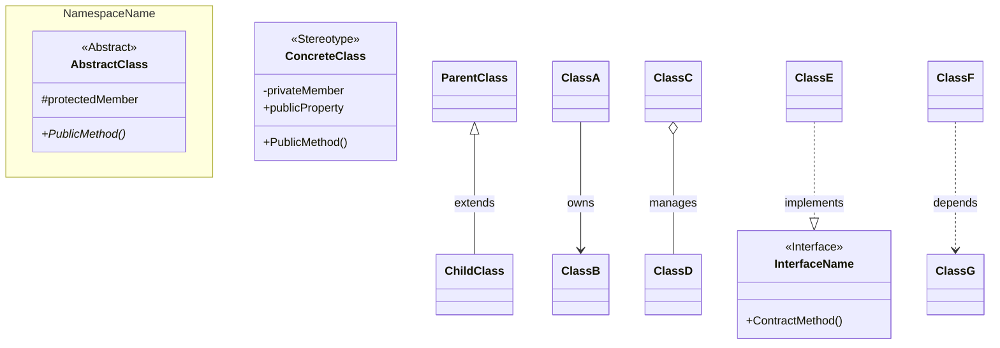

# 📐 AI Guide Chapter 03: Diagram, Encoding, Logging

이 문서는 시각화 규칙, 문서 인코딩 가드레일, 로그 표기 규칙의 상세 기준을 정의합니다.

## 1. Class Diagram Drawing Guide

### [Template]

### [Rules]

| 항목 | 규칙 |
|------|------|
| **방향** | `direction TB`(Top-Bottom) 또는 `direction LR`(Left-Right) 명시 |
| **네임스페이스** | 관련 클래스 그룹화 시 `namespace` 블록 사용 |
| **스테레오타입** | `<<Abstract>>`, `<<Interface>>`, `<<MonoBehaviour>>` 등 명시 |
| **접근제한자** | `+` public, `-` private, `#` protected |
| **추상 메서드** | 메서드명 뒤에 `*` 표시 (예: `+Enter()*`) |
| **관계 표기** | 상속 `<\|--`, 의존 `..>`, 구현 `..\|>`, 소유 `-->`, 집합 `o--` |
| **주석** | `%% Relationships` 등 섹션 구분 주석 추가 |

### [Visualization]

사용자가 시각화를 요청할 경우 위 템플릿을 기준으로 다이어그램 이미지를 생성한다.

### [Visual Style Rules]

| 항목 | 규칙 |
|------|------|
| **배경** | 순수한 흰색 배경(Pure White), 모눈종이/그리드/워터마크 금지 |
| **선 (Lines)** | 직선(Orthogonal) 우선, 곡선 최소화 |
| **텍스트** | 핵심 필드/메서드 명시 필수, 라벨이 화살표를 가리지 않게 배치 |
| **인터페이스** | 파란색 박스, 점선 테두리, `<<Interface>>` |
| **MonoBehaviour** | 노란색 박스, `<<MonoBehaviour>>` |
| **추상 클래스** | 회색 박스, `<<Abstract>>` |
| **구체 클래스** | 역할별 색상 구분 |
| **레이아웃** | 위에서 아래로 계층 구조 우선 |
| **상속/구현/소유** | 상속: 실선+빈 삼각형, 구현: 점선+빈 삼각형, 소유: 실선 화살표 |

## 2. 문서 인코딩 가드레일

* `docs/` 경로 문서(`.md`, `.txt`)는 UTF-8(UTF-8 with BOM 허용)으로 유지한다.
* PowerShell 기반 수정 시 `Set-Content`, `Out-File`, `Add-Content`에 `-Encoding utf8`을 명시한다.
* 터미널 출력이 깨져 보여도 즉시 재저장하지 않는다. 먼저 파일 바이트/인코딩을 확인한다.
* `git diff`에서 `�`, `??`, `ì`, `이` 같은 깨짐 패턴이 보이면 수정 작업을 중단하고 원인을 분리 진단한다.
* 깨진 텍스트는 인코딩 변환만으로 복원하지 않고, 정상본(이전 커밋/백업) 기준으로 수동 복구한다.
* `Input_FSM_Flow.md`, `System_Blueprint.md`, `Progress_Log/README.md`는 우선 보호 문서로 취급한다.

## 3. Progress_Log 작업 항목 표기 규칙

* 버그/폴리싱 작업 항목은 우선순위를 이모지로 표기한다: `🔴(1순위)`, `🟡(2순위)`, `🟢(3순위)`.
* 작업 대상은 제목 앞 괄호 태그로 표기한다: `(플레이어)`, `(보스)`, `(플레이어, UI)`.
* 권장 표기 예시: `- [ ] 🔴**(보스) attack1 범위 수정**: 공격 범위 넓게 수정`.

## 4. 링크 표기 규칙 (VS Code 로컬 열기)

* 파일 링크는 VS Code에서 바로 열리는 로컬 경로 형식을 사용한다.
* `file+.vscode-resource.vscode-cdn.net` 형태의 웹뷰 URL은 사용하지 않는다.
* 링크 실패 재발 방지를 위해 아래 두 규칙을 고정 적용한다.
  * Windows 백슬래시 경로(`d:\...`)를 링크 타겟으로 쓰지 않는다. 반드시 슬래시 절대경로(`/d:/...`)를 사용한다.
  * 라인 번호는 링크 텍스트 바깥에 붙이지 않는다. 반드시 링크 타겟 내부에 `:라인`으로 포함한다.
* 문서 최신화/추적 보고에서는 인덱스 링크(`docs/Progress_Log/README.md`)만 남기지 않고, 기준 로그(`docs/Progress_Log/YYYY-MM-DD.md`)를 함께 표기한다.
* 권장 형식:
  * 절대 경로: `[파일명](/d:/Unity-projects/BossRaidPortfolio/경로/파일:라인)`
  * 상대 경로: `Assets/...:라인`
* 금지 예시:
  * `[BossController.cs](d:\Unity-projects\BossRaidPortfolio\Assets\Scripts\Boss\BossController.cs) :118`
  * `[BossController.cs](/d:/Unity-projects/BossRaidPortfolio/Assets/Scripts/Boss/BossController.cs) :118`
* 문서 본문에서는 URL 전체를 붙여 넣기보다 위 형식의 경로 링크를 우선 사용한다.

