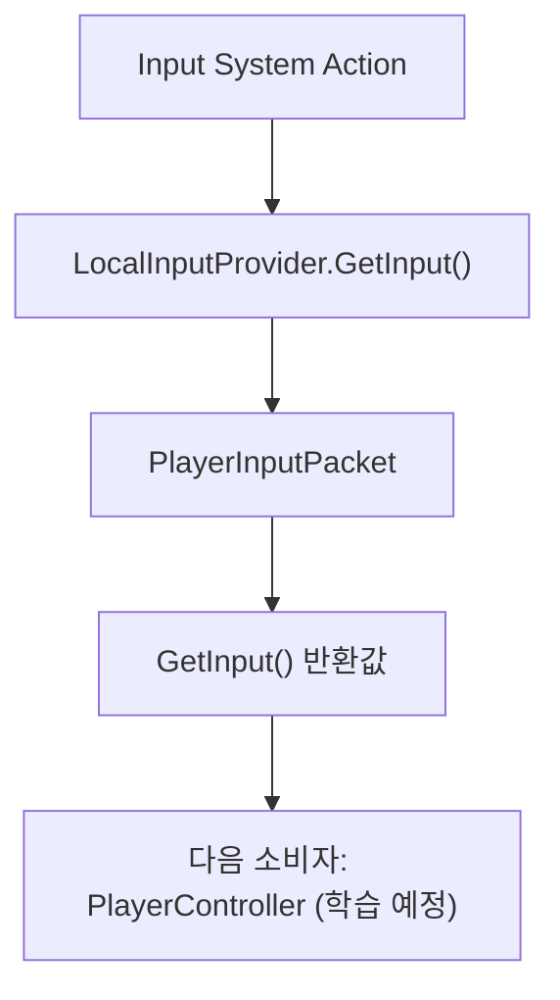

# 📚 Study Hub: Boss Raid Portfolio

이 문서는 현재 코드 기준(2026-02-22)으로, 플레이어 입력부터 전투 판정까지 "어디부터 어떻게" 따라갈지 정리한 학습 허브입니다.

---

## 1. 학습 목표

- 평일: 기능 구현 전에 코드 흐름을 빠르게 추적하고, 작업 단위를 작게 쪼개어 이해한다.
- 주말: 한 주 동안 바뀐 구조를 문서/다이어그램 관점에서 정리하고, 면접 설명 문장으로 압축한다.
- 공통: 학습 로그는 반드시 **너의 질문 -> 나의 답변 -> 너의 피드백** 3축으로 기록해, "내가 실제로 이해를 개선한 증거"를 남긴다.

---

## 2. [공부한 것] 로직 목록

| 상태 | 공부한 로직 | 핵심 확인 내용 | 근거 로그 |
| --- | --- | --- | --- |
| [x] | 입력 패킷 계약 (`PlayerInputData`) | `InputFlag`, `PlayerInputPacket`, `IInputProvider`의 책임 분리 확인 | `docs/study/logs/2026-02-21_Study_Kickoff.md`, `docs/study/logs/2026-02-22_Study_Log.md` |
| [x] | 로컬 입력 수집 (`LocalInputProvider`) | Input System 값을 `PlayerInputPacket`으로 패킹하는 지점 확인 | `docs/study/logs/2026-02-21_Study_Kickoff.md`, `docs/study/logs/2026-02-22_Study_Log.md` |
| [ ] | 입력 전달 허브 (`PlayerController`) | `GetInput()` 반환 이후 전달 흐름은 아직 미학습 | `-` |
| [ ] | 상태별 입력 소비 (`Move/Dash/Attack`) | 상태별 `Update(input)` 소비 정책은 아직 미학습 | `-` |
| [ ] | 전투/피격 연결 (`Health`, `DamageCaster`) | 데미지 이벤트 연결 구조는 아직 미학습 | `-` |

---

## 3. 한눈에 보는 흐름 (간략 Mermaid)

---

## 4. 기록 방법 (질문-답변-피드백 3축)

1. 한 세트의 기본 단위는 아래 3개다.
   - 너의 질문
   - 나의 답변
   - 너의 피드백
2. 질문은 실제 받은 문장을 최대한 원문 형태로 남긴다.
3. 나의 답변은 당시 내가 이해한 상태를 그대로 쓴다.
4. 너의 피드백은 설계/흐름/의존성 관점의 수정 포인트를 명시한다.
5. 중복 질문은 합친다. 예를 들어 데이터 생성/소비 흐름이 의존성 질문과 겹치면 별도 문항으로 반복하지 않는다.
6. 근거 코드는 필요할 때만 선택적으로 기록한다.

---

## 5. 로그 작성 절차

1. 매 세션 시작 시 `docs/study/Study_Log_Template.md`를 복사해 날짜 파일을 만든다.
2. 파일명 예시: `docs/study/logs/2026-02-22_Study_Log.md`
3. 최소 입력 항목:
   - 오늘 공부한 것 요약
   - 질문-답변-피드백 세트 1개 이상
   - 내가 이해한 로직 3줄
   - 막힌 지점
   - 다음 액션 1개 이상

---

## 6. 질문 풀 (중복 제거 규칙 포함)

| 질문 | 사용 규칙 |
| --- | --- |
| 이 클래스/시스템의 핵심 책임은 무엇인가? | 필수. "무엇을 한다"보다 "무엇을 정의/보장한다"를 먼저 말한다. |
| 이 클래스는 어떤 타입을 참조하고, 어떤 관계(상속/인터페이스)를 가지는가? | 필수. "이 클래스가 의존하는 것"과 "이 클래스를 의존하는 것"을 분리한다. |
| 이 클래스 설명 다음에 반드시 같이 봐야 할 클래스는 무엇인가? | 필수. 1순위(허브) -> 2순위(생성) -> 3순위(소비)로 우선순위를 준다. |
| 어떤 클래스/시스템이 이 데이터를 만들고, 누가 소비하는가? | 선택. 위 문항과 중복될 때는 생략하고 답변에 흐름만 통합한다. |

---

## 7. Q/A 품질 체크

- 근거 코드는 필요한 답변에서만 선택적으로 명시한다.
- 마지막에 설계 관찰 1줄을 덧붙인다.
- 추측 표현보다 확인 표현을 우선한다. 예: "코드상 확인됨", "현재 구현은 ..."

---

## 8. 주중/주말 운영 루틴

| 구분 | 권장 시간 | 할 일 |
| --- | --- | --- |
| 평일(구현 전) | 20~30분 | 오늘 건드릴 기능과 직접 연결된 단계 1개만 읽고, 로그에 "이해/모름"만 기록 |
| 평일(구현 후) | 10분 | 변경된 파일 1~2개를 같은 날 로그에 추가하고, 다음 질문 1개만 남김 |
| 주말(정리) | 60~90분 | 로그를 합쳐서 "이번 주 핵심 흐름 3개"와 "다음 주 리스크 3개"로 압축 |

---

## 9. PlayerInputData 예시 요약

1. 핵심 책임: `PlayerInputPacket` 데이터 형식, `InputFlag` 비트 규칙, `IInputProvider` 계약 정의.
2. 생성/소비: `LocalInputProvider.GetInput()` 생성 -> `PlayerController.Update()` 수집/전달 -> 각 State가 소비.
3. 관계: `PlayerInputData.cs`가 다른 클래스를 참조하기보다, 다른 클래스가 이 타입에 의존.
4. 설계 관찰: `DashState.Enter()`의 직접 입력 조회는 통일성 관점에서 개선 여지가 있다.

