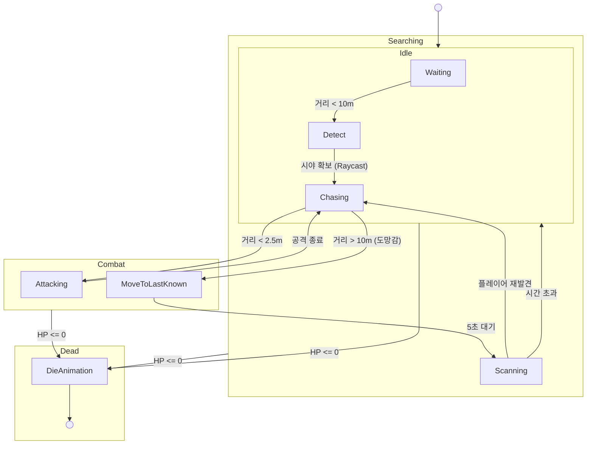

# Boss AI 알고리즘 설계

## 1. 개요 (Overview)
본 문서는 보스 몬스터의 전체 AI 설계서입니다. 추적(Tracking), 전투 개시(Combat Engagement), 공격 패턴(Attack Patterns), 피격 구조(Hit Structure) 등 보스와 관련된 모든 기술 설계를 포함합니다. 플레이어와의 거리, 시야(Line of Sight), 그리고 피격 이벤트에 따라 **대기(Idle), 전투(Combat), 수색(Searching)** 상태를 유기적으로 전환하는 **유한 상태 머신(FSM)** 구조를 채택하였습니다.

## 2. 핵심 속성 (Core Properties)

| 속성 (Property) | 설명 (Description) |
| :--- | :--- |
| **Detection Range** | 보스가 의심 상태에서 플레이어를 감지할 수 있는 최대 반경입니다. (`detectionRange`) |
| **Attack Range** | 보스가 공격 행동을 시작하는 유효 사거리입니다. (`attackRange`) |
| **View Obstacles** | 보스의 시야를 차단하는 장애물 레이어(LayerMask)입니다. (예: 벽, 기둥) |
| **Search Duration** | 플레이어를 놓쳤을 때, 대기 상태로 돌아가기 전까지 수색하는 지속 시간입니다. |

## 3. 상태 머신 흐름도 (State Machine Flow)


## 4. 상태 머신 로직 (State Machine Logic)

### 3.1. 대기 상태 (Idle / Non-Combat)
보스는 기본적으로 비전투 상태이며, 주변을 경계합니다.

*   **행동 (Behavior)**:
    *   제자리 대기 또는 정해진 경로를 순찰(Patrol - 추후 확장 예정).
*   **전투 상태 전환 조건 (Transition to Combat)**:
    *   **조건 A (Visual)**: 플레이어가 `Detection Range` 내에 있고 **AND** `HasLineOfSight()`(시야 확보)가 True일 때.
    *   **조건 B (Aggression)**: 플레이어가 `Detection Range` 내에서 공격 행동을 했을 때 (장애물 뒤에 있어도 소음/기척으로 감지).

### 3.2. 전투 상태 (Combat)
보스가 플레이어를 식별하고 적극적으로 교전하는 상태입니다.

*   **행동 (Behavior)**:
    *   플레이어를 향해 이동합니다.
    *   `Attack Range` 내에 진입하면 공격 패턴을 실행합니다.
    *   **시야 무시 (Target Lock)**: 일단 전투가 시작되면, 플레이어가 장애물 뒤로 숨더라도 일정 시간 동안은 위치를 알고 추적합니다. (감각 또는 기억 시뮬레이션)
*   **수색 상태 전환 조건 (Transition to Searching)**:
    *   플레이어가 `Detection Range` 밖으로 완전히 벗어났을 때.

### 3.3. 수색 상태 (Searching)
플레이어를 놓쳤으나, 전투 의지가 남아있어 마지막 위치를 확인하는 상태입니다.

*   **행동 (Behavior)**:
    *   **UI 피드백**: 보스 머리 위에 **'?'** 아이콘을 띄워 플레이어에게 상태를 알립니다.
    *   **이동 (Movement)**: 플레이어의 마지막 식별 위치(Last Known Position)로 **저속 이동**(`searchingMoveSpeed`)합니다.
    *   **타이머 (Timer)**: `Search Duration` 시간 동안 수색을 지속하며 카운트다운합니다.
*   **전투 상태 복귀 (Transition to Combat)**:
    *   플레이어가 다시 `Detection Range` 안으로 진입할 경우 즉시 전투 재개.
*   **대기 상태 복귀 (Transition to Idle)**:
    *   `Search Duration`이 종료될 때까지 플레이어를 찾지 못한 경우. (UI 숨김 처리)

### 3.4. 사망 상태 (Dead)
체력이 0이 되어 행동 불능이 된 상태입니다. 플레이어와 보스 모두에게 적용됩니다.

*   **진입 조건 (Transition Condition)**:
    *   `Health <= 0` (피격 시 이벤트 발생).
*   **행동 (Behavior)**:
    *   **애니메이션**: 사망 애니메이션 재생 (`Die`).
    *   **기능 비활성화**: 이동, 공격, 피격 판정(Collider) 비활성화.
    *   **AI 정지**: 상태 머신 업데이트 중단.

## 4. 감지 상세 로직 (Detection Details)

### 4.1. 시야각 확인 (CheckLineOfSight)
*   **방식**: `Physics.Raycast`
*   **원점 (Origin)**: 보스의 눈 위치 (Pivot으로부터의 Offset).
*   **방향 (Direction)**: `(Player.position - Boss.position).normalized`
*   **최대 거리**: `detectionRange`
*   **레이어 마스크**: `~LayerMask.GetMask("Player", "Ignore Raycast")` (플레이어와 무시할 레이어를 제외한 장애물 체크).

### 4.2. 플레이어 공격 감지 (CheckPlayerAggression)
*   **트리거**: 플레이어가 공격 상태(`AttackState`)이거나 실제 타격이 발생했을 때.
*   **로직**: 만약 `Player.State == Attack` **AND** `Distance <= DetectionRange`라면, 시야 여부와 관계없이 즉시 **전투(Combat)** 상태로 전환.

## 5. 시각적 디버깅 (Visual Debugging - Gizmo)
기획자가 씬 뷰(Scene View)에서 범위를 직관적으로 확인하고 조정할 수 있도록 지원합니다.

*   **Red WireSphere**: 공격 범위 (`attackRange`)
*   **Yellow WireSphere**: 감지 범위 (`detectionRange`)
*   **Ray Visualization**: 플레이어 방향으로 레이를 그려 시야 확보 여부를 색상으로 표시 (초록=확보, 빨강=차단).

## 6. 기술적 구현 상세 (Technical Implementation Details)

### 6.1. Raycast 최적화
*   **LayerMask**: `~LayerMask.GetMask("Ignore Raycast")`를 사용하여 불필요한 연산을 줄이고 장애물만 정확히 감지합니다.
*   **Origin Offset**: 발바닥(`transform.position`)이 아니라 눈높이(`Vector3.up * 1.5f`)에서 쏘아서 낮은 장애물에 가리는 문제를 방지했습니다.

### 6.2. Event-Driven Interaction (`Health.OnDie`)
*   **Decoupling**: 보스 AI가 매 프레임 `if (hp <= 0)`을 체크하지 않습니다.
*   **Efficiency**: 오직 사망 사건이 발생했을 때만 로직이 실행되므로 성능 낭비가 없습니다.

## 7. 구현된 공격 패턴 (Implemented Attack Patterns)

### 7.1. Basic Attack (기본 공격)
*   **동작**: 제자리에서 플레이어를 향해 이빨로 무는 근접 공격.
*   **로직**:
    1.  `HeadDamageCaster` 활성화.
    2.  `attackDamage` 적용.
    3.  `attackDuration` 동안 대기 후 종료.
*   **DamageCaster 배치 (Bone-Synced Hitbox)**:
    ```
    Dragon Model → Head Bone
     └── HeadDamageCasterPlace (Transform)  ← DamageCaster._castCenter
    ```
    Head Bone의 자식 오브젝트(`HeadDamageCasterPlace`)를 생성하여 `DamageCaster`의 `castCenter`로 할당합니다.
    이로 인해 별도의 좌표 계산 없이도, 물기 애니메이션 시 머리가 앞으로 나갈 때 공격 판정 범위(Sphere)가 물리적으로 동기화되어 함께 이동합니다.
    (기존에는 머리가 나가도 판정은 몸통 쪽에 머무는 문제가 있었음)

### 7.2. Claw Attack (할퀴기 돌진)
*   **동작**: 플레이어를 향해 회전 후, 짧은 거리를 도약(Rush)하여 발톱으로 할퀴는 공격.
*   **전략 패턴(Strategy)**: `IBossAttackPattern`을 구현하여 `BossAttackState`의 수정 없이 추가됨.
*   **애니메이션 동기화 (Animation Sync)**:
    *   `normalizedTime`을 사용하여 애니메이션 진행률에 따라 이동과 종료를 정밀하게 제어합니다.
    *   단순 시간 대기(`WaitForSeconds`)가 아닌, 실제 애니메이션 재생 길이에 맞춰 로직이 실행되므로 애니메이션 속도가 변해도 안전합니다.
*   **설정(`ClawAttackSettings`)**:
    *   `damageMultiplier`: 기본 공격력의 1.5배.
    *   `rushSpeed`: 도약 속도.
    *   `rushPhaseRatio`: 애니메이션의 30%(`0.3`) 지점까지만 돌진 이동 적용.
    *   `exitPhaseRatio`: 애니메이션의 50%(`0.5`) 지점에서 강제 종료하여 복귀 모션을 생략.

---

## 8. 피격 구조 (Hit Structure — Compound Collider)

Dragon 모델은 단일 Mesh Collider 대신 **Compound Collider**(복합 충돌체) 방식을 사용합니다.

### 8.1. 구조 (Bone-Synced Hierarchy)
물리 판정용 콜라이더를 모델의 본(Bone) 구조 아래에 직접 배치하여, 애니메이션에 따른 위치 변화를 자동으로 추적합니다.

```
Boss (Root)
├── CharacterController       ← 이동 전용 (Physics)
├── Health                    ← HP 관리 (본체)
└── Dragon Model (Visual)
    └── Root / Pelvis / ...
        ├── Head Bone
        │   └── BossHitBox (Head) ← CapsuleCollider (Trigger)
        ├── Body Bone
        │   └── BossHitBox (Body) ← CapsuleCollider (Trigger)
        └── Tail Bone
            └── BossHitBox (Tail) ← CapsuleCollider (Trigger)
```

이 구조 덕분에 도약(Rush)이나 물기 공격 시 모델이 크게 움직여도 판정 영역이 완벽하게 동기화됩니다.

### 8.2. 데이터 흐름
```
DamageCaster (Player Sword)
  → OverlapSphereNonAlloc으로 BossHitBox(IDamageable) 감지
    → BossHitBox.TakeDamage(damage)
      → _ownerHealth.TakeDamage(damage)  ← Health(본체)로 위임
```

### 8.3. 중복 피격 방지
`DamageCaster`가 한 프레임에 Head, Body, Tail 콜라이더를 모두 감지하더라도, `BossHitBox.Owner`(= 본체 Health)의 `InstanceID`를 추적하여 **한 번의 공격에 한 번의 데미지만** 적용됩니다.

---

## 9. 디버그 설정 (Feature Toggles)

개발 중 특정 기능을 인스펙터에서 개별적으로 켜고 끌 수 있도록 `BossController`에 다음 토글이 구현되어 있습니다.

| 토글 | 기본값 | 설명 |
|------|--------|------|
| `enableChase` | ✅ On | 보스가 플레이어를 추적하여 이동 |
| `enableRotation` | ✅ On | 보스가 타겟 방향으로 회전 |
| `enableBasicAttack` | ✅ On | Basic Attack 패턴 사용 허용 |
| `enableClawAttack` | ✅ On | Claw Attack 패턴 사용 허용 |

*   **사용 목적**: 특정 기능 없이 다른 기능만 테스트하고 싶을 때 유용. 예) 공격만 끄고 추적 로직 디버깅.
*   **패턴 선택 로직**: 둘 다 활성화 시 50% 확률로 랜덤 선택. 하나만 활성화 시 해당 패턴만 실행.
