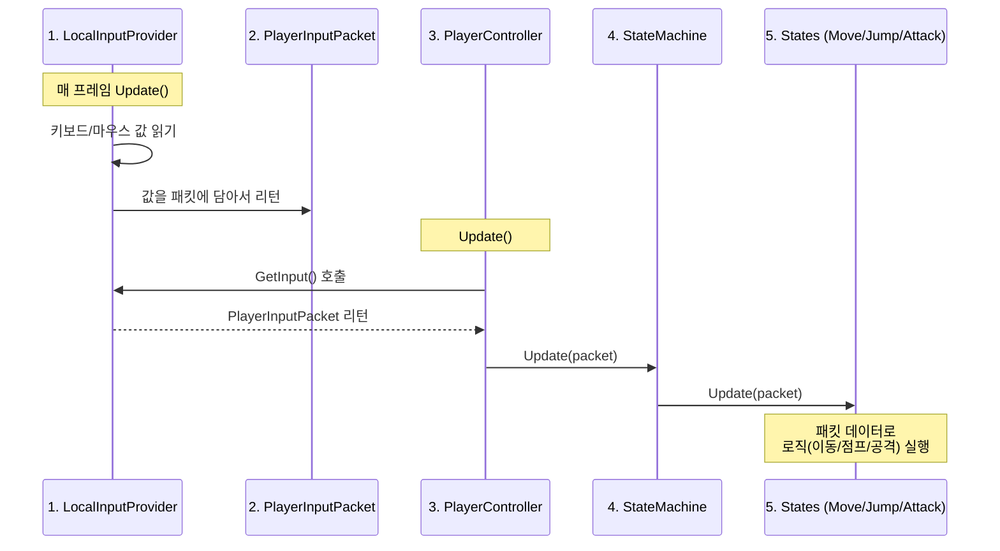
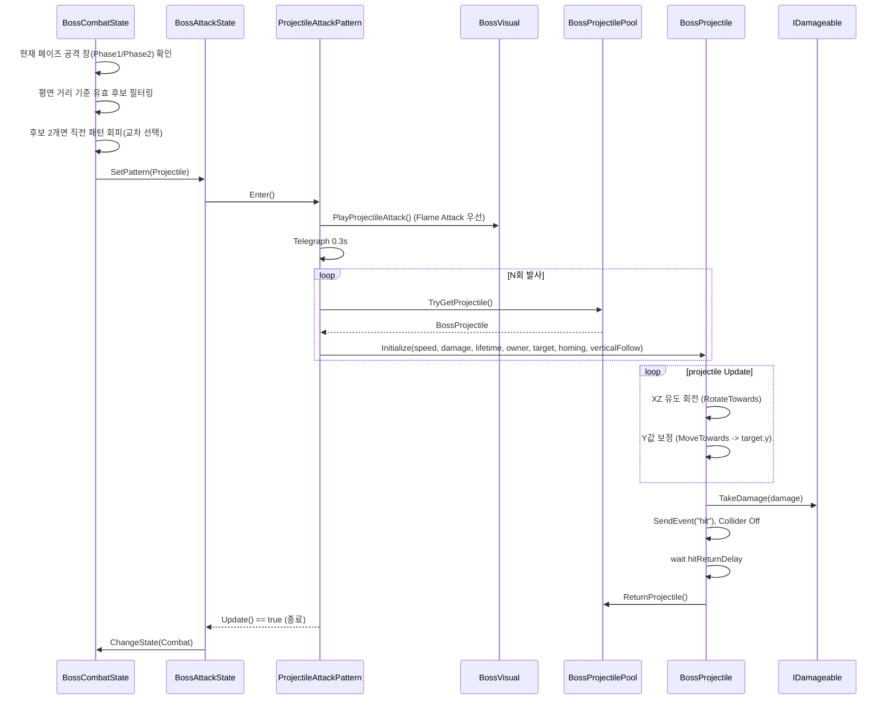
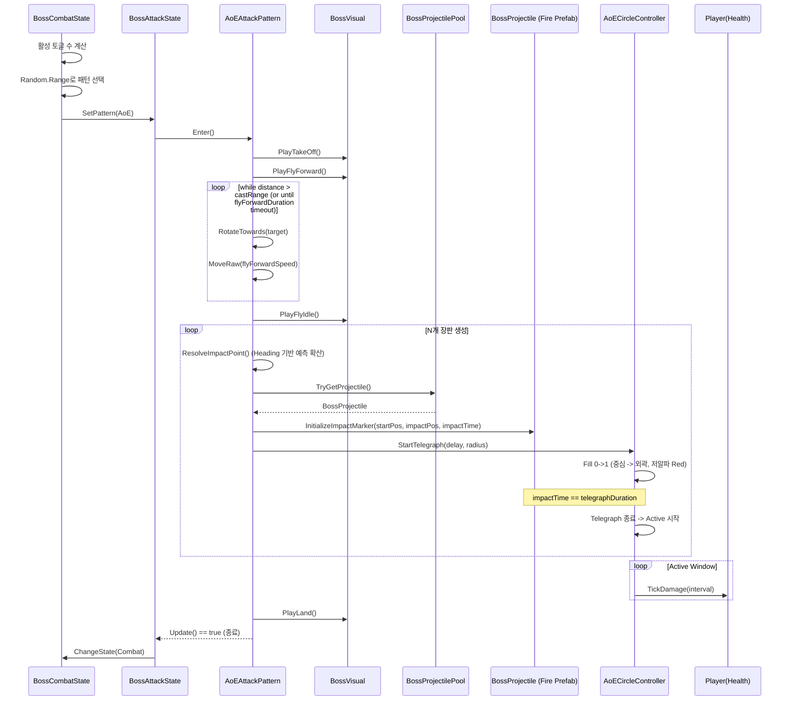

# 🔄 Input System & FSM Data Flow

플레이어 입력이 어떻게 캐릭터 동작으로 이어지는지 설명합니다.

---

## 데이터 흐름도



---

## 1. PlayerInputPacket (데이터 택배상자)

```csharp
// PlayerInputData.cs
public struct PlayerInputPacket {
    public Vector2 moveDir;   // WASD 입력 방향
    public float lookYaw;     // 마우스 좌우 (Y축 회전)
    public float lookPitch;   // 마우스 위아래 (X축 회전)
    public byte buttons;      // 대시/공격 버튼 (비트로 압축)
}
```

| 특징 | 설명 |
|------|------|
| `struct` 사용 | GC 발생 안 함, 매 프레임 생성해도 성능 OK |
| `byte buttons` | 비트 연산으로 8개 버튼을 1바이트에 압축 |

---

## 2. LocalInputProvider (입력 수집기)

```csharp
public PlayerInputPacket GetInput() {
    PlayerInputPacket packet = new PlayerInputPacket();
    packet.moveDir = _inputActions.Player.Move.ReadValue<Vector2>().normalized;
    packet.lookYaw = _currentYaw;
    packet.lookPitch = _currentPitch;
    packet.SetFlag(InputFlag.Dash, _inputActions.Player.Dash.IsPressed());
    return packet;
}
```

- **역할**: 유니티 Input System에서 실시간 입력을 읽고 `PlayerInputPacket`에 포장
- **확장성**: 나중에 `NetworkInputProvider`로 교체하면 네트워크 입력도 같은 방식으로 처리 가능

---

## 3. PlayerController (중앙 관제탑)

```csharp
private void Update() {
    PlayerInputPacket input = _inputProvider.GetInput();
    cameraRoot.rotation = Quaternion.Euler(input.lookPitch, input.lookYaw, 0f);
    
    // Generic StateMachine은 Update를 직접 가지지 않음
    _stateMachine.CurrentState?.Update(input);
}
```

- **카메라 회전**: 공통 동작이므로 직접 처리
- **나머지 로직**: 현재 상태(CurrentState)에게 위임

---

## 4. StateMachine (교통정리)

```csharp
// StateMachine<TState>
public void ChangeState(TState newState) {
    // 1. 기존 상태 종료
    if (CurrentState is IState exitState) 
        exitState.Exit();

    // 2. 상태 교체
    CurrentState = newState;

    // 3. 새 상태 시작
    if (CurrentState is IState enterState) 
        enterState.Enter();
}
```

- **역할**: 상태 보관 및 전환(`ChangeState`)만 담당.
- **특징**: 제네릭(`T`)으로 구현되어 Player와 Boss가 로직을 공유함.

---

## 5. States (Move, Jump, Dash, Attack)

```csharp
// MoveState.cs
public override void Update(PlayerInputPacket input) {
    UpdateRotation(input);  // input.moveDir 사용
    
    if (input.HasFlag(InputFlag.Dash)) {
        Controller.StateMachine.ChangeState(Controller.DashState);
    }
}
```

### 5.5. Dead State (사망)
체력이 0이 되면 강제로 전환되는 상태입니다.

*   **진입 조건**: `Health.OnDie` 이벤트 발생 시.
*   **특징**:
    *   입력 처리 중단 (Input Ignored).
    *   이동 및 회전 정지.
    *   `Die` 애니메이션 재생 후 로직 종료.

---

## 요약 테이블

| 순서 | 파일 | 역할 |
|------|------|------|
| 1 | `LocalInputProvider` | 키보드/마우스 값 → `PlayerInputPacket` 생성 |
| 2 | `PlayerController` | 패킷 받아서 카메라 회전 + StateMachine 호출 |
| 3 | `StateMachine` | 현재 상태의 `Update(packet)` 실행 |
| 4 | `Move` / `Jump` / `Attack` | 패킷 데이터로 실제 이동/점프/공격 처리 |

---

## 6. State Transition Pipeline (Deep Dive)
상태 전환(`ChangeState`) 시 발생하는 실행 흐름의 동기적 특성을 설명합니다.

### 상태 전환의 2단계 프로세스

#### [1단계] Frame N: 동기적 교체 (Synchronous Swap)
1. `ChangeState(NewState)` 호출.
2. `OldState.Exit()` -> `_currentState = NewState` -> `NewState.Enter()` 순차 실행.
3. **중요**: 함수 호출이 종료되면 실행 흐름은 `ChangeState`를 호출했던 지점의 **다음 줄**로 돌아와 남은 코드를 마저 실행함.

#### [2단계] Frame N+1: 새로운 로직 시작 (New Logic)
1. 다음 프레임의 `Update()` 루프에서 `_currentState.Update()` 호출.
2. 이제 `_currentState`가 `NewState`를 가리키고 있으므로, 새로운 상태의 로직만 실행됨.

> **결론**: 상태 변수 교체는 즉각적(Sync)이지만, 해당 상태의 반복 로직(`Update`)은 다음 프레임부터 실행됨.

---

## 7. Boss Combat Pipeline (Projectile Pattern)
보스는 Combat 상태에서 현재 페이즈와 플레이어 평면 거리(XZ)를 기준으로 실행 가능한 패턴 후보만 추려 선택합니다. 후보가 2개면 직전 패턴을 피해 교차 선택합니다.



- `BossProjectilePool`은 `Awake`에서 Prewarm 후 재사용합니다.
- 풀 고갈 + 확장 비활성화 시 해당 발사는 스킵되며 경고 로그를 남깁니다.
- 투사체는 **발사 시점에는 SpawnPoint의 Y값**으로 시작하고, 비행 중 `verticalFollowSpeed`로 플레이어 Y값에 수렴합니다.
- 유도(`homingStrength`, `homingDuration`)는 XZ 평면 기준으로 처리하여 수평 추적 안정성을 유지합니다.
- 피격 판정은 `OnTriggerEnter` + `OnCollisionEnter`를 모두 처리하며, 필요 시 `GetComponentInParent<IDamageable>()`로 부모 컴포넌트까지 탐색합니다.
- VFX 프리팹 사용 시 충돌 즉시 반납하지 않고 `hit` 이벤트 재생 후 `hitReturnDelay`가 끝나면 풀로 반납합니다.
- Projectile 패턴 종료는 단순 `volleyCount`가 아니라 `postFireRecoveryDuration` + `exitNormalizedTime` 조건을 함께 만족해야 하므로 Flame 공격 직후 조기 Locomotion 복귀를 줄입니다.
- `BossCombatState`의 추적/공격 거리 판정은 평면(XZ) 거리와 `현재 페이즈 활성 패턴의 최대 사거리`(해제), `최대 사거리 + ChaseReengageBuffer`(재진입) 히스테리시스를 사용해 경계 지터를 완화합니다.

---

## 8. Boss Combat Pipeline (Pattern 4: AoE Pattern)
Pattern 4는 보스가 공중으로 이륙한 뒤 브레스를 쏘아 바닥에 장판을 생성하는 구조입니다.



- AoE 장판은 `Telegraph -> Active -> End` 3단계 수명주기로 분리합니다.
- AoE는 `BossCombatState`에서 현재 거리(`AoEAttackRange`) 조건을 만족할 때만 선택되며, 진입 후 `FlyForward`에서 추적해 `castRange` 이내에 들어오면 `FlyIdle` 캐스팅으로 전환합니다.
- AoE 발사체는 별도 풀을 만들지 않고 기존 `BossProjectilePool`의 fire prefab을 재사용합니다.
- 장판 생성점은 타겟의 진행 방향을 예측해 전방 편향으로 분포시킵니다 (`headingLeadTime`, `maxHeadingLeadDistance`, `forwardSpreadRadius`, `sideSpreadRadius`, `headingBias`, `headingMinSpeed`).
- 공격 판정 시작 시점은 fire prefab 착지 시점과 동일해야 하며, 기본 규칙은 `telegraphDuration == projectile impactTime`입니다.
- 구현 코드: `Assets/Scripts/Boss/Attacks/AoEAttackPattern.cs`, `Assets/Scripts/Boss/AoE/AoECircleController.cs`, `Assets/Scripts/Boss/Projectiles/BossProjectile.cs`.
- 텔레그래프 Fill은 머티리얼 인스턴스 복제를 피하기 위해 `MaterialPropertyBlock` 기반으로 갱신합니다.
- 데미지 판정은 `Physics.OverlapSphereNonAlloc` + 선할당 버퍼로 처리합니다.
- 장판 생성 위치는 지면 투영(Raycast)으로 확정하며, 마스크 미스매치 상황에서는 공통 지면 레이어/비타겟 레이어 폴백을 사용합니다.
- 비행 연출 기본 체인은 `takeOff -> FlyForward -> FlyIdle -> Land`로 고정하고, 브레스 타이밍은 `FlyIdle` 구간에서 동기화합니다.
- AoE Enter~Exit 구간에서는 `SetLocomotionVisualSuppressed(true/false)`로 Locomotion 시각 잠금을 적용해 Walk가 비행 애니메이션을 덮어쓰지 않게 보호합니다.
- `FlyForward` 상태가 없는 Animator에서는 `PlayFlyIdle()`로 폴백해 공중 연출 연속성을 유지합니다.

