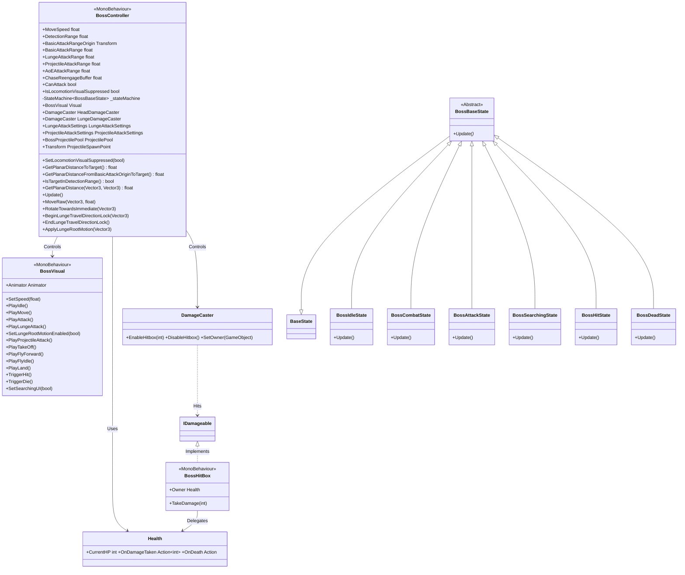
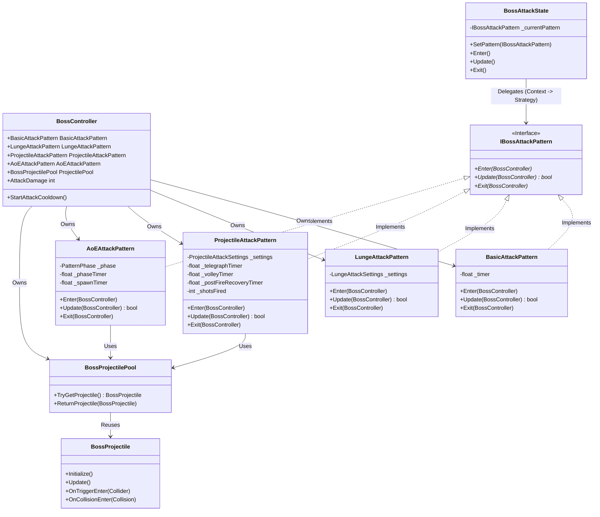
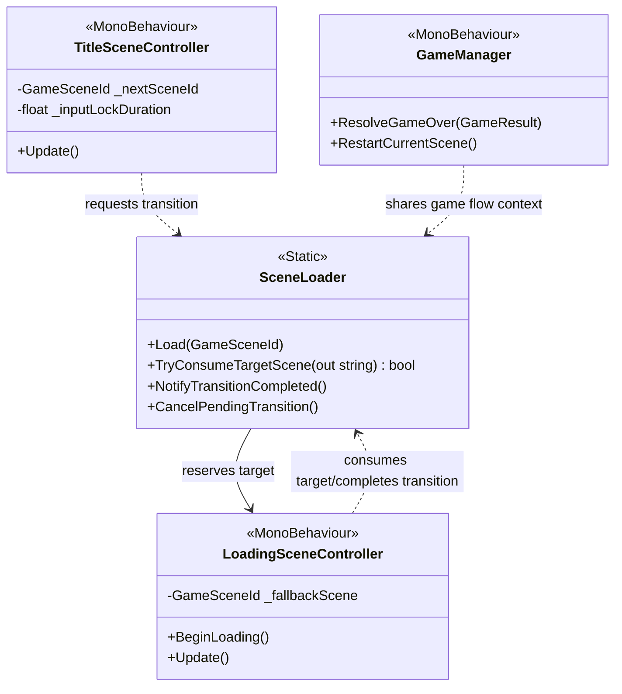

# 🛠️ System Blueprint: Boss Raid Portfolio

이 문서는 프로젝트의 핵심 아키텍처 설계와 데이터 규칙을 정의합니다. AI 및 개발자는 이 청사진을 준수하여 코드를 작성해야 합니다.

## 1. Core Architecture Philosophy
* **Decoupling (탈응집)**: 입력(Provider) → 해석(Controller) → 행동(State)의 단방향 의존성 유지.
* **Network-Ready Data**: 로직에는 `bool`이나 `Input` 클래스를 직접 사용하지 않고, 반드시 직렬화 가능한 `PlayerInputPacket` 구조체만 전달한다.
* **Zero-GC**: `Update` 루프 내에서의 메모리 할당(new)을 금지하며, 구조체(Struct)와 NonAlloc 물리 API를 사용한다.

---

## 2. Technical Class Diagram (Target Architecture)
본 프로젝트는 `StateMachine` 패턴을 기반으로 Player와 Boss의 로직을 제어합니다.

### 2.1. Player System Architecture

```mermaid
classDiagram
    direction TB

    %% Interfaces
    class IInputProvider {
        <<Interface>>
        +GetInput() PlayerInputPacket
    }
    class IDashContext {
        <<Interface>>
        +StartDashCooldown()
    }
    class IAttackable {
        <<Interface>>
        +AttackCombos AttackComboData[]
    }
    class IDamageable {
        <<Interface>>
        +TakeDamage(int)
    }

    %% Data
    class PlayerInputPacket { <<Struct>> }
    class AttackComboData { <<Struct>> }
    class InputFlag { <<Enumeration>> }

    %% Core Components
    class PlayerController {
        <<MonoBehaviour>>
        +MoveSpeed float
        +Animator Animator
        -_stateMachine StateMachine
        +MoveState MoveState
        +DashState DashState
        +JumpState JumpState
        +AttackState AttackState
        +HitState HitState
        +DeadState DeadState
        +PlayerVisual Visual
        +Update()
    }

    class BaseState {
        <<Abstract>>
        +Enter()
        +Exit()
    }

    class PlayerBaseState {
        <<Abstract>>
        +Update(PlayerInputPacket)*
    }

    class LocalInputProvider { +GetInput() }
    class PlayerVisual { +Animator Animator }
    class CombatHUDController {
        +Initialize(Health, Health)
        +SetPlayerName(string)
        +SetBossName(string)
        +SetPlayerTorso(Sprite)
        +ShowHud(bool)
        +ShowDamageFeedback(bool, int)
    }
    class DamageCaster {
        +OnAttackWindowResolved Action~bool,int~
        +EnableHitbox(int)
        +DisableHitbox()
    }
    class Health {
        +CurrentHP int
        +OnDamageTaken Action
        +OnDeath Action
    }

    %% Concrete States
    class MoveState { +Update() }
    class DashState { +Update() }
    class JumpState { +Update() }
    class AttackState { +Update() }
    class HitState { +Update() }
    class DeadState { +Update() }

    %% Relationships
    LocalInputProvider ..|> IInputProvider : implements
    PlayerController ..|> IDashContext : implements
    PlayerController ..|> IAttackable : implements
    Health ..|> IDamageable : implements

    PlayerController --> IInputProvider : uses
    PlayerController --> PlayerVisual : controls
    PlayerController --> DamageCaster : controls/subscribes
    PlayerController --> CombatHUDController : updates
    PlayerController --> Health : owns

    PlayerBaseState --|> BaseState : extends
    MoveState --|> PlayerBaseState : extends
    DashState --|> PlayerBaseState : extends
    JumpState --|> PlayerBaseState : extends
    AttackState --|> PlayerBaseState : extends
    HitState --|> PlayerBaseState : extends
    DeadState --|> PlayerBaseState : extends

    DamageCaster ..> IDamageable : depends
    LocalInputProvider o-- PlayerInputPacket : creates
```

### 2.2. Boss AI Architecture (The Dragon)
거리 기반 상태 전환과 비주얼 분리(BossVisual)가 적용된 보스 전용 구조입니다.

**관련 코드:**
*   **Controller**: `Assets/Scripts/Boss/BossController.cs`
*   **Visual**: `Assets/Scripts/Boss/BossVisual.cs`
*   **States**: `Assets/Scripts/Boss/BossFSM.cs` (모든 Boss State 클래스 포함)
*   **Attack Patterns**: `Assets/Scripts/Boss/Attacks/` (`IBossAttackPattern.cs`, `BasicAttackPattern.cs`, `LungeAttackPattern.cs`, `ProjectileAttackPattern.cs`, `AoEAttackPattern.cs`)
*   **Combat**: `Assets/Scripts/Common/Combat/Health.cs`, `Assets/Scripts/Common/Combat/DamageCaster.cs`, `Assets/Scripts/Common/Combat/BossHitBox.cs`

### 2.3. Boss Attack System (Strategy Pattern)
공격 패턴의 확장성을 위해 `Strategy Pattern`을 적용했습니다. `BossAttackState`는 구체적인 공격 로직을 알지 못하며, 주입된 `IBossAttackPattern`에게 실행을 위임합니다.

**관련 코드:**
*   **Attack Patterns**: `Assets/Scripts/Boss/Attacks/` (`IBossAttackPattern.cs`, `BasicAttackPattern.cs`, `LungeAttackPattern.cs`, `ProjectileAttackPattern.cs`, `AoEAttackPattern.cs`)
*   **Projectile Pooling**: `Assets/Scripts/Boss/Projectiles/` (`BossProjectilePool.cs`, `BossProjectile.cs`)

### 2.4. Game Flow Architecture (Title -> Loading -> GamePlay)
타이틀 입력, 로딩 연출, 전투 씬 진입을 분리한 게임 루프 시작 구간 구조입니다.

**관련 코드:**
*   **Flow Entry**: `Assets/Scripts/Common/TitleSceneController.cs`
*   **Transition Router**: `Assets/Scripts/Common/SceneLoader.cs`
*   **Loading Orchestrator**: `Assets/Scripts/Common/LoadingSceneController.cs`
*   **Result & Restart**: `Assets/Scripts/Common/GameManager.cs`

---

## 3. Data Rules & Coding Standards

### [Input System]

* **Packet Structure**: `PlayerInputData.cs`에 정의된 `PlayerInputPacket`을 사용한다.
* **Bit-Masking**: 버튼 입력은 `bool` 필드를 늘리지 않고 `InputFlag` 열거형과 비트 연산(`|`, `&`, `~`)을 통해 `byte buttons` 필드 하나로 처리한다.
* *Example*: `if (input.HasFlag(InputFlag.Dash)) ...`

### [Physics & Movement]

* **Rotation Logic**:
* `lookYaw`, `lookPitch`: **CameraRoot** 회전용 (마우스 입력).
* `moveDir`: **Character Body** 회전 및 이동용 (키보드 입력).
* 캐릭터 몸통은 카메라가 바라보는 방향(`cameraRoot.forward`)을 기준으로 이동 벡터를 변환해야 한다.
* **Boss Planar Distance Rule**: Boss의 감지/추적/공격 사거리 판정은 Y축을 제외한 수평(XZ) 거리 기준으로 계산한다.
* **Boss Pattern Range Rule**: 보스 공격 사거리는 패턴별 인스펙터 값(`Basic`, `Lunge`, `Projectile`, `AoE`)으로 분리하며, 패턴 선택 시 현재 거리에서 유효한 패턴만 후보로 포함한다.
* **Boss Basic Range Origin Rule**: Basic 공격 사거리 판정은 `basicAttackRangeOrigin` 기준점에서 타겟까지의 XZ 거리로 계산한다. 기준점이 비어 있으면 Boss Root를 폴백으로 사용한다. 기본 씬 설정은 `HeadDamageCasterPlace`를 사용한다.
* **Boss Basic Range-Hitbox Sync Rule**: `basicAttackRange`와 `HeadDamageCaster.radius`를 동일 값으로 유지해 사거리 판정과 실제 타격 반경이 어긋나지 않도록 한다.
* **Boss Phase1 Attack Priority Rule**: Phase1에서 Basic/Lunge 조건이 동시에 만족되면 Basic을 우선 선택한다. Lunge는 Basic 범위를 벗어났고 Lunge 범위는 만족할 때만 선택한다.
* **Boss Lunge Root Motion Relay Rule**: Lunge 이동은 `rushPhaseRatio/MoveRaw` 수동 전진이 아니라, Animator `OnAnimatorMove`의 델타를 `BossController.ApplyLungeRootMotion`으로 전달해 부모 루트를 이동시킨다. 적용 시 Y축은 제외(XZ만 반영)하고, 활성화 구간은 `SetLungeRootMotionEnabled(true/false)`로 제한한다. 기본 소스는 `animator.deltaPosition`이며 값이 0/미소 프레임일 때는 `Visual`의 실제 월드 이동량을 폴백으로 사용한다. 릴레이는 Lunge 시작 시 `Visual` 로컬 기준 포즈를 캐시하고 `OnAnimatorMove`/종료 시 복원해 부모 루트와 자식 비주얼 좌표가 분리되지 않도록 유지한다. Lunge 시작 시점에는 타겟 방향을 한 번 고정(`BeginLungeTravelDirectionLock`)하고, 루트모션 델타의 크기만 고정 방향에 적용해 플레이어 방향 도약을 안정화한다. Lunge 타이밍은 히트박스 종료(`normalizedTime 0.8`)와 상태 종료(`normalizedTime 1.0`)를 분리해 운영한다.
* **Boss Detection Trigger Rule**: Idle/Searching에서 Combat 전환(스크림 인트로 진입)은 `IsTargetInDetectionRange()` 기준으로 즉시 수행한다. 현재 보스 감지는 장애물/시야선(LOS) 판정을 사용하지 않는다.
* **Boss Chase Hysteresis**: 단일 임계값 대신 "현재 페이즈에서 활성화된 패턴 중 최대 사거리"(해제)와 `최대 사거리 + ChaseReengageBuffer`(재진입) 이중 임계값을 사용해 경계 왕복 지터를 완화한다.

* **Optimization**:
* 물리 판정 시 `Physics.OverlapSphere` 금지 → **`Physics.OverlapSphereNonAlloc`** 사용.
* 모든 물리 쿼리 결과 배열(`Collider[]`)은 클래스 멤버 변수로 미리 할당(Pre-allocate)하여 재사용한다.

### [FSM Implementation Guide]

* **Role of Controller**: `PlayerController`는 `CharacterController.Move()`와 같은 실제 물리 실행 메서드만 `public`으로 열어두고, '어떻게' 움직일지 결정하는 로직은 `State` 클래스에 위임한다.
* **State Transition**: 상태 전환은 `StateMachine.ChangeState()`를 통해서만 이루어져야 한다.
* **Controller Member Layout Rule**: 컨트롤러 클래스는 필드 선언을 먼저 모아 배치하고, `OnValidate`를 포함한 메서드는 필드 선언 이후에 배치해 선언부와 실행부를 분리한다.

---

## 4. Implementation Status Check

### 4.1. Core Systems & Input
| Component | Status | Note |
| --- | --- | --- |
| **IInputProvider** | ✅ Done | `LocalInputProvider.cs` 구현 완료. |
| **Input Packet** | ✅ Done | `PlayerInputPacket` (Bit-packing) 적용 완료. |
| **StateMachine** | ✅ Done | `BossRaid.Patterns` 네임스페이스 적용 및 구현 완료. |
| **Physics System** | ✅ Done | `NonAlloc` 물리 판정(OverlapSphere) 및 최적화 완료. |
| **Object Pooling** | ✅ Done | `BossProjectilePool` 기반 투사체 재사용(Prewarm/Max/Expand) 구현 완료. |
| **Package Baseline** | ✅ Done | Unity 2022.3 기준으로 package manifest 정리 및 lock 재생성 경로 복구 (`URP/VFX 14.0.12`, `TMP 추가`, Unity 6 전용 의존성 제거). |
| **External Asset Distribution Policy** | ✅ Done | free tier 저장소 정책상 대용량 서드파티 에셋(`CombatGirlsCharacterPack`, `FourEvilDragonsPBR`, `UNI VFX`)은 Git에서 제외하고 팀원이 동일 버전을 수동 임포트한다. 레포에는 코드/설정/문서와 경량 참조 데이터만 유지한다. |

### 4.2. Player System
| Component | Status | Note |
| --- | --- | --- |
| **Movement Logic** | ✅ Done | `MoveState`로 로직 이관 완료. |
| **Dash Logic** | ✅ Done | Cooldown 및 Edge-triggering 기능 포함 구현 완료. |
| **Jump Logic** | ✅ Done | `JumpState` 구현 완료. 현재 게임 디자인 기준 점프 입력 전환은 비활성(주석/F10 유지) 상태이며 필요 시 재활성 가능. |
| **Camera Logic** | ✅ Done | CameraRoot 분리 및 로컬 회전 구현 완료. |
| **Attack Logic** | ✅ Done | `AttackState` 구현 완료. 콤보/캔슬/개별 데미지 지원. 상태 전환 시 `AttackState.Exit()`에서 히트박스를 강제 종료해 잔존 판정을 방지하며, `DamageCaster`는 0 데미지 윈도우를 무시한다. |
| **Hit/Damage System** | ✅ Done | `IDamageable`, `DamageCaster`, `Health` 구현 완료. |
| **Asset Integration** | ✅ Done | `PlayerAnimator`의 `Hit/Attack1/2/3/Die` 상태 모션 재연결 완료(2026-02-21). |
| **Environment Fix Guard (환경 오류 복구)** | ✅ Done | `Assets/Editor/PlayerAnimatorGuard.cs`로 환경 변경 시 발생하는 Animator 참조 오류를 자동 복구/검증한다. 필수 state/motion + 파라미터(`Speed` Float, `Hit` Trigger) 누락 점검, 모든 Layer + 중첩 StateMachine 재귀 순회, Locomotion BlendTree 자식 모션 검증, 중복 상태명 경고, 로드/임포트/이동/메뉴 경로를 지원하며 `Hit` 상태명은 `PlayerController.ANIM_STATE_HIT` 상수를 공용 참조한다. 추가로 `Attack1/2/3` 클립의 `OnHitStart/OnHitEnd` 이벤트 자동 보정 및 누락/순서 검증, `Tools/Validation/Fix Player Attack Events` 메뉴를 포함한다. |

### 4.3. Boss System (The Dragon)
| Component | Status | Note |
| --- | --- | --- |
| **Boss Logic (FSM)** | ✅ Done | `BossController` 상태 머신 (Idle, Combat, Searching, Dead) |
| **Boss Sensors** | ✅ Done | `IsTargetInDetectionRange`(XZ 거리 기반) 단일 규칙으로 Idle/Searching 전투 진입을 처리한다. 장애물 LOS 센서는 제거됨 |
| **Boss Navigation** | ✅ Done | `MoveTo` (추적 이동) 및 `RotateTowards` (회전) 로직 + AoE 공중 연출 중 Locomotion 시각 잠금 가드 + `ChaseReengageBuffer` 기반 히스테리시스 추적 |
| **Boss Visuals** | ✅ Done | 구조 분리 및 Dragon Asset(Animator/BlendTree) 통합 완료. `PlayFlyForward` 폴백을 비행 계열로 정리해 Walk 혼입 방지. |
| **Boss Combat** | 🔃 progress | `Pattern 1`(Basic), `Pattern 2`(Lunge), `Pattern 3`(Projectile: Flame Attack + Homing + Vertical Follow + VFX create/hit + hitReturnDelay + postFireRecovery/exitNormalizedTime) 완료. 패턴별 공격 사거리 분리(`Basic/Lunge/Projectile/AoE`) 및 거리 기반 패턴 후보 필터링, 최대 사거리 기반 추적 히스테리시스 반영. Basic 사거리 기준점은 `basicAttackRangeOrigin`(기본 씬: `HeadDamageCasterPlace`)으로 분리되었고, `basicAttackRange`-`HeadDamageCaster.radius` 동기화로 판정 반경을 일치시켰다. Lunge는 `rushPhaseRatio` 수동 이동을 제거하고 루트모션 브리지(`OnAnimatorMove -> ApplyLungeRootMotion`)로 착지 지점을 부모 루트에 고정한다. 또한 `deltaPosition` 미소 프레임 폴백과 `Visual` 로컬 기준점 복원으로 부모/자식 좌표 불일치를 방지한다. Phase1에서는 Basic/Lunge 동시 충족 시 Basic 우선 규칙을 적용한다. `Pattern 4`(AoE)는 진행 중이다. |

### 4.4. User Interface (UI)
| Component | Status | Note |
| --- | --- | --- |
| **UI System** | ✅ Done | 전투 HUD 배치 + `CombatHUDController` 연동 완료. `Health.OnDamageTaken/OnDeath` 이벤트로 플레이어/보스 HP Fill을 즉시 갱신하고, `DamageCaster.OnAttackWindowResolved` 결과를 `HIT + 피해량` 고정형 피드백(스케일 강조 후 짧은 페이드 아웃)으로 표시한다. 이름 라벨(`Player`, `Dragon`) 및 `ShowHud(bool)` 기반 전체 표시 제어를 포함한다. |

### 4.5. Game Logic & Flow
| Component | Status | Note |
| --- | --- | --- |
| **Game Loop** |  ✅ Done | `TitleSceneController`로 아무 키 입력 시작점을 분리했고, `SceneLoader` + `LoadingSceneController` 경유 전투 진입/`GameManager` 결과 처리까지 연결했다. `GamePlayScene_TestResult` + `SimultaneousDeathTest`로 동시 사망 시 `Victory` 출력 검증을 완료했다. 일반 실플레이 회귀 시나리오 검증은 남아 있다. |

### 4.6. Network Architecture
| Component | Status | Note |
| --- | --- | --- |
| **Netcode Prep** | ⬜ Todo | 추후 `NetworkInputProvider` 추가 예정. |

---

### 💡 Antigravity Prompting Guide (Plan-First)

이 파일을 기반으로 AI에게 작업을 지시할 때는 **구현 요청 전 계획서 승인**을 먼저 진행합니다.

#### 권장 요청 순서

1. 계획서 요청: 설계/영향 범위/검증 기준을 먼저 받는다.
2. 승인 응답: 계획서 확인 후 승인 또는 수정 요청을 준다.
3. 구현 요청: 승인된 계획서 기준으로만 구현 + 문서 동기화를 요청한다.

#### 계획서 최소 항목

| 항목 | 설명 |
| --- | --- |
| 목표 | 이번 변경으로 달성할 기능/문제 해결 목표 |
| 영향 클래스/파일 | 수정 대상과 연관 컴포넌트 |
| 설계 근거 | `System_Blueprint`의 어떤 원칙/구조를 따르는지 |
| 리스크 | 회귀 가능성, 충돌 가능성, 범위 외 영향 |
| 검증 포인트 | 테스트/수동 검증 시나리오와 성공 기준 |
| 문서 동기화 계획 | `docs/Progress_Log/YYYY-MM-DD.md` 기준 로그 지정 + `System_Blueprint`, `Technical_Glossary` 반영 계획 |

#### Progress_Log 추적 메모 규칙

1. 구현 현황/규칙 문구를 수정할 때는 근거 로그 파일을 1개 이상 지정한다.
2. 완료 보고에 `참조 로그: docs/Progress_Log/YYYY-MM-DD.md`를 남겨 변경 근거를 추적 가능하게 유지한다.

#### 프롬프트 예시

> "System_Blueprint.md를 기준으로 신규 기능 구현 계획서를 먼저 작성해줘. 영향 클래스, 리스크, 검증 포인트를 포함하고 승인 전에는 코드를 수정하지 마."

> "계획서 승인. 승인된 범위대로 구현하고, 완료 후 Progress_Log 기술적 고려에 [무엇을 발견/무엇을 수정/왜 그렇게 판단] 3항목을 남겨줘."

### 4.7. Compatibility Note (Unity 2022)
| Component | Status | Note |
| --- | --- | --- |
| **AoE Heading Sampling** | ✅ Done | AoEAttackPattern의 타겟 속도 샘플링은 Unity 2022 기준 Rigidbody.velocity를 사용한다. |
| **Editor Assembly Anchor** | ✅ Done | Assets/Editor/EditorAssemblyAnchor.cs를 통해 에디터 전용 어셈블리 생성 경로를 고정. |
| **URP Global Settings Hygiene** | 🔃 progress | GUID 스캔 기준 미해결 참조가 `Assets/Settings/UniversalRenderPipelineGlobalSettings.asset`에 49건 남아 있어, Unity 에디터에서 URP Global Settings 재생성/재할당 후 확정 커밋이 필요하다. |
