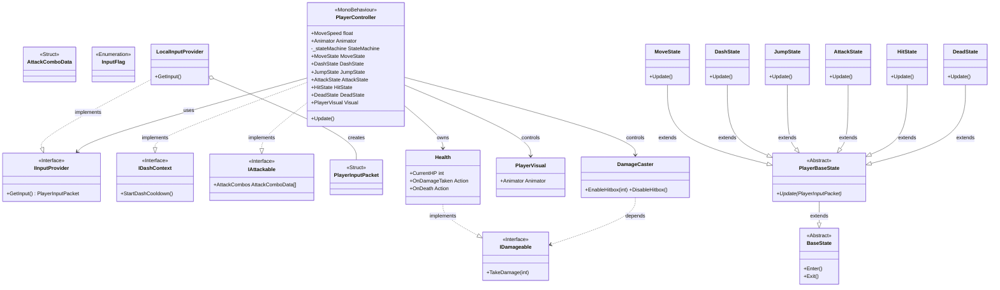
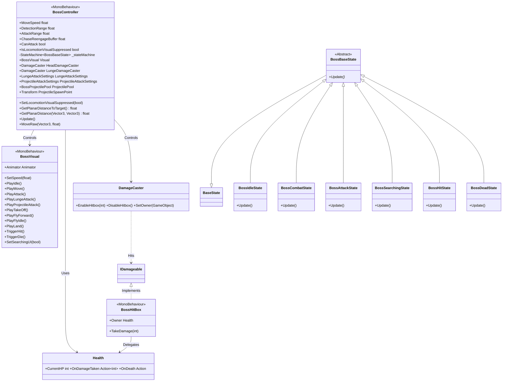
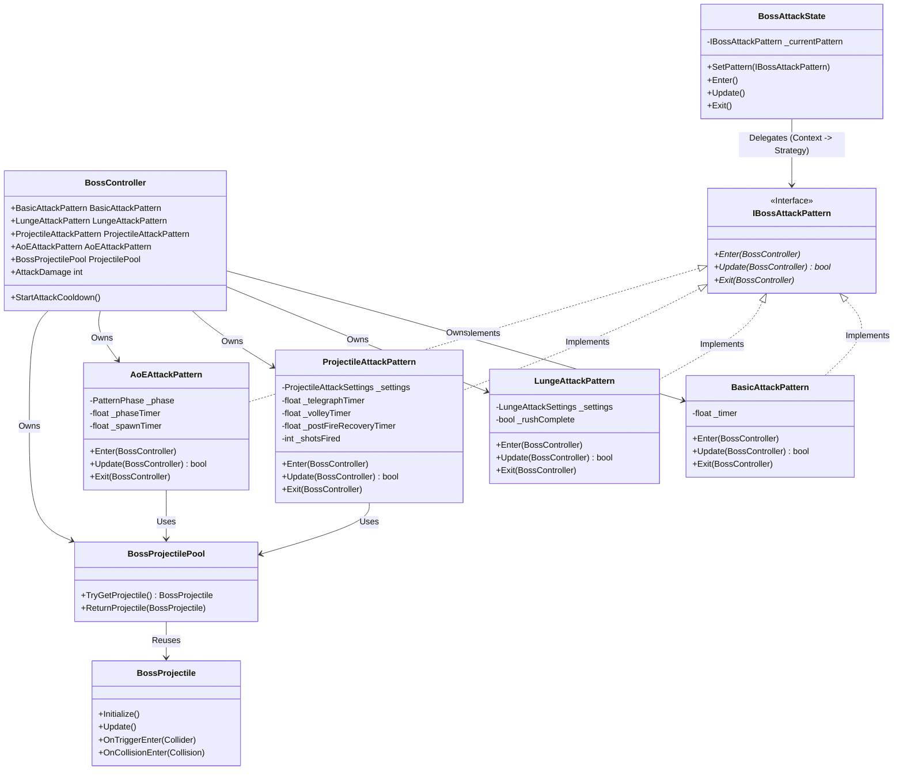

# 🛠️ System Blueprint: Boss Raid Portfolio

이 문서는 프로젝트의 핵심 아키텍처 설계와 데이터 규칙을 정의합니다. AI 및 개발자는 이 청사진을 준수하여 코드를 작성해야 합니다.

## 1. Core Architecture Philosophy
* **Decoupling (탈응집)**: 입력(Provider) → 해석(Controller) → 행동(State)의 단방향 의존성 유지.
* **Network-Ready Data**: 로직에는 `bool`이나 `Input` 클래스를 직접 사용하지 않고, 반드시 직렬화 가능한 `PlayerInputPacket` 구조체만 전달한다.
* **Zero-GC**: `Update` 루프 내에서의 메모리 할당(new)을 금지하며, 구조체(Struct)와 NonAlloc 물리 API를 사용한다.

---

## 2. Technical Class Diagram (Target Architecture)
본 프로젝트는 `StateMachine` 패턴을 기반으로 Player와 Boss의 로직을 제어합니다.

### 2.1. Player System Architecture

### 2.2. Boss AI Architecture (The Dragon)
거리 기반 상태 전환과 비주얼 분리(BossVisual)가 적용된 보스 전용 구조입니다.

**관련 코드:**
*   **Controller**: `Assets/Scripts/Boss/BossController.cs`
*   **Visual**: `Assets/Scripts/Boss/BossVisual.cs`
*   **States**: `Assets/Scripts/Boss/BossFSM.cs` (모든 Boss State 클래스 포함)
*   **Attack Patterns**: `Assets/Scripts/Boss/Attacks/` (`IBossAttackPattern.cs`, `BasicAttackPattern.cs`, `LungeAttackPattern.cs`, `ProjectileAttackPattern.cs`, `AoEAttackPattern.cs`)
*   **Combat**: `Assets/Scripts/Common/Combat/Health.cs`, `Assets/Scripts/Common/Combat/DamageCaster.cs`, `Assets/Scripts/Common/Combat/BossHitBox.cs`

### 2.3. Boss Attack System (Strategy Pattern)
공격 패턴의 확장성을 위해 `Strategy Pattern`을 적용했습니다. `BossAttackState`는 구체적인 공격 로직을 알지 못하며, 주입된 `IBossAttackPattern`에게 실행을 위임합니다.

**관련 코드:**
*   **Attack Patterns**: `Assets/Scripts/Boss/Attacks/` (`IBossAttackPattern.cs`, `BasicAttackPattern.cs`, `LungeAttackPattern.cs`, `ProjectileAttackPattern.cs`, `AoEAttackPattern.cs`)
*   **Projectile Pooling**: `Assets/Scripts/Boss/Projectiles/` (`BossProjectilePool.cs`, `BossProjectile.cs`)

---

## 3. Data Rules & Coding Standards

### [Input System]

* **Packet Structure**: `PlayerInputData.cs`에 정의된 `PlayerInputPacket`을 사용한다.
* **Bit-Masking**: 버튼 입력은 `bool` 필드를 늘리지 않고 `InputFlag` 열거형과 비트 연산(`|`, `&`, `~`)을 통해 `byte buttons` 필드 하나로 처리한다.
* *Example*: `if (input.HasFlag(InputFlag.Dash)) ...`

### [Physics & Movement]

* **Rotation Logic**:
* `lookYaw`, `lookPitch`: **CameraRoot** 회전용 (마우스 입력).
* `moveDir`: **Character Body** 회전 및 이동용 (키보드 입력).
* 캐릭터 몸통은 카메라가 바라보는 방향(`cameraRoot.forward`)을 기준으로 이동 벡터를 변환해야 한다.
* **Boss Planar Distance Rule**: Boss의 감지/추적/공격 사거리 판정은 Y축을 제외한 수평(XZ) 거리 기준으로 계산한다.
* **Boss Chase Hysteresis**: `AttackRange` 단일 임계값 대신 `AttackRange + ChaseReengageBuffer` 재진입 구간을 사용해 경계 왕복 지터를 완화한다.

* **Optimization**:
* 물리 판정 시 `Physics.OverlapSphere` 금지 → **`Physics.OverlapSphereNonAlloc`** 사용.
* 모든 물리 쿼리 결과 배열(`Collider[]`)은 클래스 멤버 변수로 미리 할당(Pre-allocate)하여 재사용한다.

### [FSM Implementation Guide]

* **Role of Controller**: `PlayerController`는 `CharacterController.Move()`와 같은 실제 물리 실행 메서드만 `public`으로 열어두고, '어떻게' 움직일지 결정하는 로직은 `State` 클래스에 위임한다.
* **State Transition**: 상태 전환은 `StateMachine.ChangeState()`를 통해서만 이루어져야 한다.

---

## 4. Implementation Status Check

### 4.1. Core Systems & Input
| Component | Status | Note |
| --- | --- | --- |
| **IInputProvider** | ✅ Done | `LocalInputProvider.cs` 구현 완료. |
| **Input Packet** | ✅ Done | `PlayerInputPacket` (Bit-packing) 적용 완료. |
| **StateMachine** | ✅ Done | `BossRaid.Patterns` 네임스페이스 적용 및 구현 완료. |
| **Physics System** | ✅ Done | `NonAlloc` 물리 판정(OverlapSphere) 및 최적화 완료. |
| **Object Pooling** | ✅ Done | `BossProjectilePool` 기반 투사체 재사용(Prewarm/Max/Expand) 구현 완료. |
| **Package Baseline** | ✅ Done | Unity 2022.3 기준으로 package manifest 정리 및 lock 재생성 경로 복구 (`URP/VFX 14.0.12`, `TMP 추가`, Unity 6 전용 의존성 제거). |
| **External Asset Distribution Policy** | ✅ Done | free tier 저장소 정책상 대용량 서드파티 에셋(`CombatGirlsCharacterPack`, `FourEvilDragonsPBR`, `UNI VFX`)은 Git에서 제외하고 팀원이 동일 버전을 수동 임포트한다. 레포에는 코드/설정/문서와 경량 참조 데이터만 유지한다. |

### 4.2. Player System
| Component | Status | Note |
| --- | --- | --- |
| **Movement Logic** | ✅ Done | `MoveState`로 로직 이관 완료. |
| **Dash Logic** | ✅ Done | Cooldown 및 Edge-triggering 기능 포함 구현 완료. |
| **Jump Logic** | ✅ Done | `JumpState` 구현 완료. 현재 게임 디자인 기준 점프 입력 전환은 비활성(주석/F10 유지) 상태이며 필요 시 재활성 가능. |
| **Camera Logic** | ✅ Done | CameraRoot 분리 및 로컬 회전 구현 완료. |
| **Attack Logic** | ✅ Done | `AttackState` 구현 완료. 콤보/캔슬/개별 데미지 지원. |
| **Hit/Damage System** | ✅ Done | `IDamageable`, `DamageCaster`, `Health` 구현 완료. |
| **Asset Integration** | ✅ Done | `PlayerAnimator`의 `Hit/Attack1/2/3/Die` 상태 모션 재연결 완료(2026-02-21). |
| **Environment Fix Guard (환경 오류 복구)** | ✅ Done | `Assets/Editor/PlayerAnimatorGuard.cs`로 환경 변경 시 발생하는 Animator 참조 오류를 자동 복구/검증한다. 필수 state/motion + 파라미터(`Speed` Float, `Hit` Trigger) 누락 점검, 모든 Layer + 중첩 StateMachine 재귀 순회, Locomotion BlendTree 자식 모션 검증, 중복 상태명 경고, 로드/임포트/이동/메뉴 경로를 지원하며 `Hit` 상태명은 `PlayerController.ANIM_STATE_HIT` 상수를 공용 참조한다. 추가로 `Attack1/2/3` 클립의 `OnHitStart/OnHitEnd` 이벤트 자동 보정 및 누락/순서 검증, `Tools/Validation/Fix Player Attack Events` 메뉴를 포함한다. |

### 4.3. Boss System (The Dragon)
| Component | Status | Note |
| --- | --- | --- |
| **Boss Logic (FSM)** | ✅ Done | `BossController` 상태 머신 (Idle, Combat, Searching, Dead) |
| **Boss Sensors** | ✅ Done | `CheckLineOfSight` (Raycast) 및 거리 감지 로직 |
| **Boss Navigation** | ✅ Done | `MoveTo` (추적 이동) 및 `RotateTowards` (회전) 로직 + AoE 공중 연출 중 Locomotion 시각 잠금 가드 + `ChaseReengageBuffer` 기반 히스테리시스 추적 |
| **Boss Visuals** | ✅ Done | 구조 분리 및 Dragon Asset(Animator/BlendTree) 통합 완료. `PlayFlyForward` 폴백을 비행 계열로 정리해 Walk 혼입 방지. |
| **Boss Combat** | 🔃 progress | `Pattern 1`(Basic), `Pattern 2`(Lunge), `Pattern 3`(Projectile: Flame Attack + Homing + Vertical Follow + VFX create/hit + hitReturnDelay + postFireRecovery/exitNormalizedTime) 완료. 경계 지터 완화를 위한 추적 히스테리시스 및 Flame 종료 동기화 반영. `Pattern 4`(AoE) 진행 중. |

### 4.4. User Interface (UI)
| Component | Status | Note |
| --- | --- | --- |
| **UI System** | ⬜ Todo | 플레이어 HUD, Boss 체력바, 메뉴 등 구현 필요. |

### 4.5. Game Logic & Flow
| Component | Status | Note |
| --- | --- | --- |
| **Game Loop** | ⬜ Todo | 게임 매니저, 승리/패배 흐름 제어, 씬 전환. |

### 4.6. Network Architecture
| Component | Status | Note |
| --- | --- | --- |
| **Netcode Prep** | ⬜ Todo | 추후 `NetworkInputProvider` 추가 예정. |

---

### 💡 Antigravity Prompting Guide

이 파일을 기반으로 AI에게 작업을 지시할 때 다음과 같이 요청하세요:

> "System_Blueprint.md의 **FSM Layer** 섹션을 참고해서, 현재 `PlayerController.cs`에 있는 이동 로직을 추출하여 `MoveState` 클래스를 작성하고, `PlayerController`에는 상태 머신을 연결해줘."

### 4.7. Compatibility Note (Unity 2022)
| Component | Status | Note |
| --- | --- | --- |
| **AoE Heading Sampling** | ✅ Done | AoEAttackPattern의 타겟 속도 샘플링은 Unity 2022 기준 Rigidbody.velocity를 사용한다. |
| **Editor Assembly Anchor** | ✅ Done | Assets/Editor/EditorAssemblyAnchor.cs를 통해 에디터 전용 어셈블리 생성 경로를 고정. |
| **URP Global Settings Hygiene** | 🔃 progress | GUID 스캔 기준 미해결 참조가 `Assets/Settings/UniversalRenderPipelineGlobalSettings.asset`에 49건 남아 있어, Unity 에디터에서 URP Global Settings 재생성/재할당 후 확정 커밋이 필요하다. |
