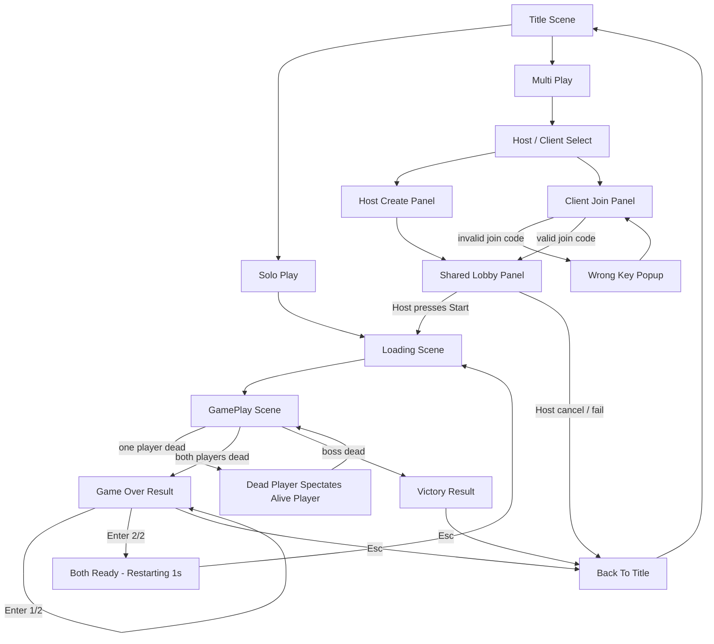
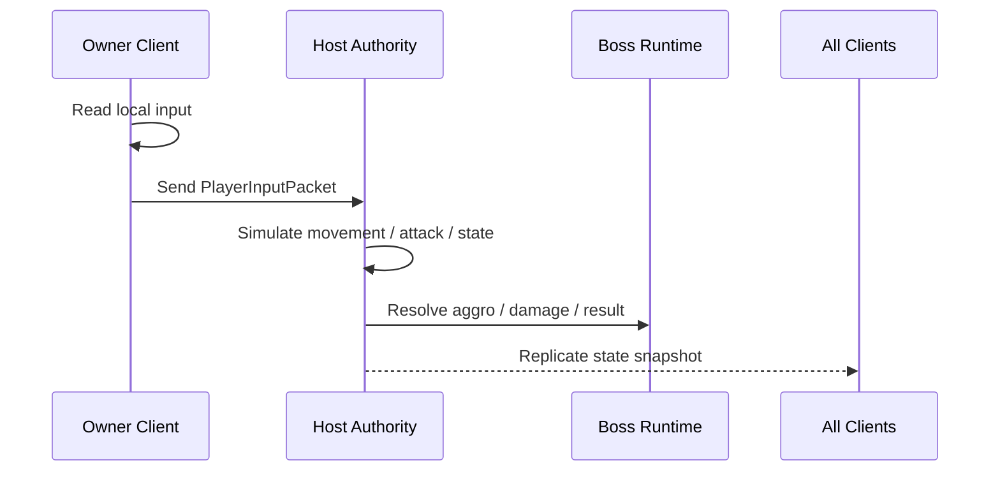
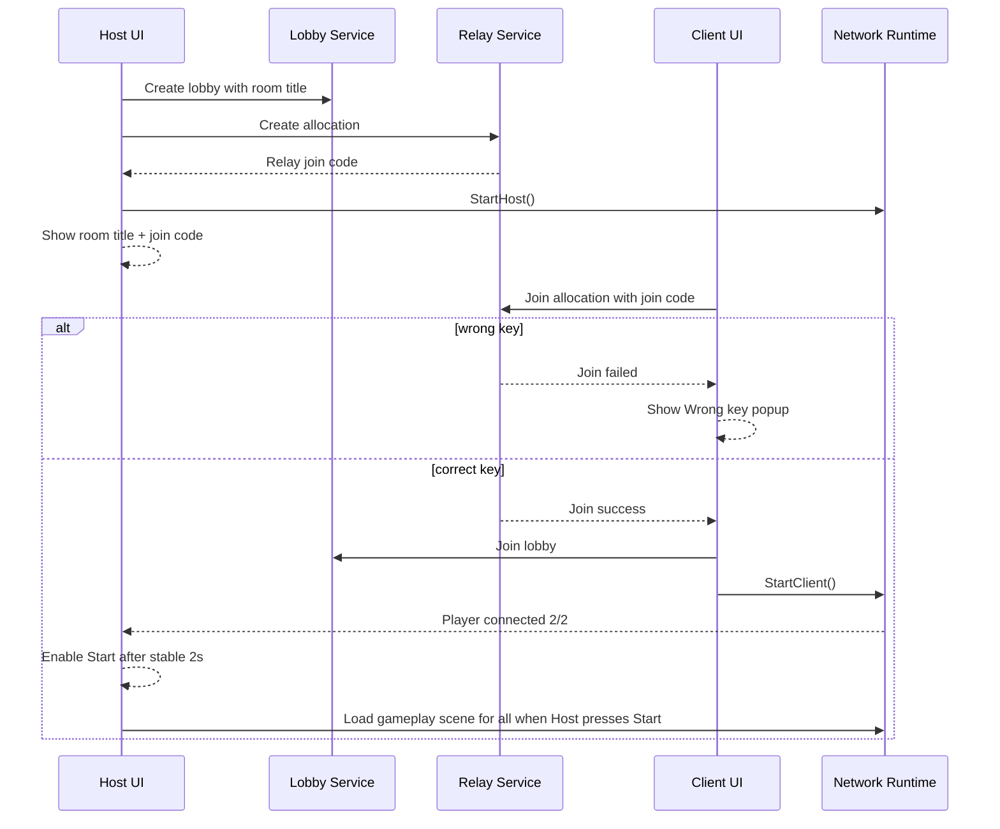

# 🌐 Multiplayer Design: Boss Raid Portfolio

이 문서는 2인 협동 멀티플레이의 목표 구조와 런타임 규칙을 정의한다.
현재 기준선은 `Solo Play 유지 + 2P Online Co-op 추가`다.
기존 `docs/technical/GDD.md`의 오래된 네트워크 메모와 충돌하면, 멀티플레이 범위에서는 이 문서를 우선한다.

---

## 1. 문서 목적 (Purpose)

이 문서는 아래 항목의 멀티플레이 기준 문서다.

* 타이틀 UI 확장
* Host / Client / Lobby 흐름
* Relay/Lobby 기반 인터넷 접속
* 2인 드래곤 레이드 전투 규칙
* 보스 타깃(aggro) 규칙
* 사망 후 spectator 카메라 규칙
* 공동 재시작 / 타이틀 복귀 규칙

---

## 2. 확정 결정 사항 (Locked Decisions)

| 항목 | 결정 |
| --- | --- |
| 플레이 인원 | 2 players only |
| 기본 모드 유지 | `Solo Play`는 기존 싱글플레이 흐름 유지 |
| 멀티플레이 스택 | `Netcode for GameObjects + Unity Transport + Relay + Lobby` |
| 연결 방식 | 인터넷 초대 코드 + Lobby metadata |
| 권한 모델 | `Listen-Server / Host Authority` |
| 세션 종료 처리 | any failure or Host exit closes session and returns all players to `TitleScene` |
| 프리게임 시작 방식 | Host-only `Start` button after `2/2 connected` |
| 복제 기준 | both players see each other, attack result, and boss through Host-authoritative replication |
| 전투 대상 | 드래곤 1마리 + 플레이어 2명 |
| 멀티플레이 씬 흐름 | `TitleScene -> LoadingScene -> GamePlayScene` |
| 결과 처리 | 두 플레이어 모두 사망 시 패배, 보스 처치 시 승리 |
| 재시작 처리 | 두 플레이어 모두 `Enter` 입력 시 재시작 |
| spectator | 사망 2초 후, 죽은 플레이어 카메라는 살아있는 플레이어의 exact camera를 본다 |

### 2.1. 용어 메모 (One-line Note)

* `NGO`는 Unity 안에서 플레이어, 오브젝트, RPC를 동기화하는 게임용 네트워크 프레임워크다.

### 2.2. 설계 제한 (Scope Limit)

이번 범위는 아래를 포함하지 않는다.

* Dedicated server
* 3인 이상 확장
* 재접속(Reconnect)
* 음성 채팅
* 복잡한 매치메이킹 필터

---

## 3. 멀티플레이 씬/화면 흐름 (Scene & UI Flow)

멀티플레이 UI는 새 씬을 추가하지 않고, 기본적으로 `TitleScene` 안의 패널 확장으로 처리한다.
`LoadingScene`은 그대로 유지하고, 멀티플레이에서는 Host가 씬 전환을 동기화한다.



### 3.1. 화면 패널 정의 (Panel Definition)

| 패널 | 주요 요소 | 규칙 |
| --- | --- | --- |
| `TitleMainPanel` | `Solo Play`, `Multi Play` | 더 이상 `press any key` 시작 구조를 사용하지 않는다. solo, multi button이 있다.|
| `MultiplayerModePanel` | `Host`, `Client`, `Back to Title` | 멀티플레이 진입 후 분기 선택용 패널이다. |
| `HostCreatePanel` | optional room title input, `Create Room`, `Back` | 제목이 비어 있으면 자동 제목을 생성한다. |
| `ClientJoinPanel` | Relay join code input, `Join`, `Back` | 잘못된 키 입력 시 popup을 띄우고 다시 입력받는다. |
| `LobbyPanel` | room title, join code, connected players, waiting text, `Start`, back/cancel | Host와 Client가 공통으로 보는 대기 패널이다. Start 버튼은 Host에게만 보이고, `2/2 connected` 상태가 2초 유지되면 활성화된다. |
| `WrongKeyPopup` | message text, `OK` | 메시지는 `Wrong key. Please type again.` 를 기본값으로 사용한다. |

### 3.2. 룸 제목 규칙 (Room Title Rule)

* Host는 방 제목을 직접 입력할 수 있다.
* Host가 제목을 비워 두면 자동 제목을 생성한다.
* 자동 제목 형식은 `join here 0000` 이다.
* `0000`은 랜덤 4자리 숫자다.
* Room title은 표시용 metadata다.
* 실제 접속 키는 `Relay join code`다.

### 3.3. Lobby 패널 표시 규칙 (Lobby Panel Rule)

* `Client` 버튼을 누르면 join code 입력 패널과 lobby 정보 영역을 함께 노출할 수 있다.
* Lobby panel에는 항상 `room title`이 보이도록 유지한다.
* Host가 방을 만들면 room title과 join code를 즉시 표시한다.
* Client가 올바른 join code로 입장하면 같은 lobby panel로 합류한다.
* 두 플레이어가 모두 입장하면 `2/2 connected` 상태를 표시한다.
* `2/2 connected` 상태가 2초 유지되면 Host의 `Start` 버튼이 활성화된다.
* Host가 `Start`를 누르면 Host가 게임 씬 전환을 시작한다.

---

## 4. 네트워크 구조 (Network Architecture)

### 4.1. 기본 구조

이 프로젝트의 멀티플레이 1차 구조는 `Listen-Server`다.
즉, Host가 서버 역할과 플레이어 역할을 동시에 가진다.

| 역할 | 책임 |
| --- | --- |
| Host | session state, boss AI, aggro, hit validation, death/result, restart, scene travel authority |
| Client Owner | local input capture, local UI, local camera |
| All Peers | replicated character/boss visuals, result UI |

### 4.2. 서비스 사용 방향

| 서비스 | 역할 |
| --- | --- |
| `Unity Lobby` | room metadata 저장, room title 표시, player count 관리 |
| `Unity Relay` | 인터넷 경유 접속 코드 제공 |
| `Unity Transport` | NGO의 실제 데이터 전송 계층 |
| `Netcode for GameObjects` | player object, boss object, RPC, NetworkVariable 동기화 |

### 4.3. 권한 규칙 (Authority Rule)

아래는 멀티플레이 시 기준 규칙이다.

1. Host is the gameplay authority.
2. Boss AI runs on Host only.
3. Damage and death are resolved on Host.
4. Player movement and attack simulation for both players are resolved on Host after owner input arrives.
5. Scene load and restart are triggered by Host.
6. Each player owns only their local input and local camera.
7. Camera and HUD stay local-only. They are not replicated gameplay objects.

### 4.4. 입력 동기화 방향 (Input Sync Direction)

기존 `PlayerInputPacket` 구조는 유지한다.
멀티플레이에서는 owner client가 입력 패킷을 만들고 Host에 전달한다.
Host는 입력을 받아 두 플레이어의 gameplay state를 시뮬레이션하고, 그 결과를 양쪽에 복제한다.



### 4.5. 소유권 / 복제 기준표 (Ownership / Replication Map)

| 대상 | 입력/제어 주체 | 최종 판정 주체 | 복제 대상 |
| --- | --- | --- | --- |
| Host player | Host local input | Host | Client |
| Client player | Client local input -> Host | Host | Host + Client |
| Boss | Host AI | Host | Host + Client |
| Damage / death / result | attack event source -> Host | Host | Host + Client |
| Camera | local player only | local player only | not replicated |
| HUD / menu UI | local player only | local player only | not replicated |

---

## 5. 접속 흐름 (Join Flow)



### 5.1. 잘못된 키 처리 (Wrong Key Handling)

* Wrong key는 `invalid`, `expired`, `not found` 같은 Relay join 실패를 같은 UX로 묶어 처리한다.
* 사용자 문구는 단순하게 유지한다.
* 기본 문구는 아래와 같다.

```text
Wrong key. Please type again.
```

### 5.2. 세션 정리 규칙 (Session Cleanup Rule)

이 멀티플레이 범위의 세션 정리 기준은 `Strict close`다.

1. If create/join/start fails, close the multiplayer session and return to `TitleScene`.
2. If Host presses `Back` or `Cancel` in multiplayer flow, close Lobby, Relay, and NGO session, then return to `TitleScene`.
3. If Host leaves during gameplay, the session closes for both players and both return to `TitleScene`.
4. Client does not stay in lobby alone after Host exit.
5. This version does not support reconnect or host migration.

---

## 6. 플레이 규칙 (Gameplay Rules)

### 6.1. 플레이어 스폰 규칙 (Spawn Rule)

* 멀티플레이 게임플레이 씬은 2개의 고정 spawn anchor를 사용한다.
* Host player와 Client player는 서로 다른 시작 위치에 스폰된다.
* Solo Play에서는 기존 단일 플레이어 스폰 구조를 유지한다.

### 6.2. 보스 타깃 규칙 (Boss Aggro Rule)

이 보스는 항상 `alive player`만 타깃 후보로 본다.

기본 규칙은 아래와 같다.

1. If there is no hit override, the boss picks the nearest alive player.
2. If the farther player hits the boss, target switches to that attacker.
3. If both players hit the boss, aggro uses hit time as the override hint.
4. If the same target stayed fixed for more than 5 seconds, the boss refreshes target selection.
5. Refresh first checks recent hit information, then falls back to nearest alive player.

### 6.3. 권장 런타임 데이터 (Suggested Runtime Data)

| 데이터 | 의미 |
| --- | --- |
| `CurrentTargetClientId` | 현재 보스가 바라보는 대상 |
| `LastHitClientId` | 가장 최근에 보스를 타격한 플레이어 |
| `LastHitTimeByPlayer` | 플레이어별 마지막 타격 시각 |
| `AggroRefreshInterval = 5.0f` | 고정 타깃 강제 재평가 주기 |

### 6.4. 사망 후 spectator 규칙 (Death Camera Rule)

* 한 플레이어가 죽고 다른 플레이어가 살아 있으면, 즉시 게임오버로 가지 않는다.
* 죽은 플레이어는 2초 동안 자신의 사망 상태를 본다.
* 2초 후, 죽은 플레이어의 로컬 카메라는 살아있는 플레이어의 exact camera를 따라간다.
* 살아있는 플레이어의 카메라와 입력은 변경하지 않는다.
* spectator는 죽은 플레이어 쪽 로컬 표현만 바뀐다.
* 두 플레이어가 모두 죽으면 spectator보다 game over 결과가 우선한다.

정리하면 아래와 같다.

1. Dead player loses control.
2. Alive player keeps full control.
3. After 2 seconds, dead player watches the alive player's exact camera.
4. If both are dead, switch to defeat flow.

---

## 7. 결과 처리 규칙 (Result Rules)

### 7.1. 패배 규칙 (Defeat)

* 두 플레이어가 모두 죽으면 패배다.
* 패배 UI는 양쪽 플레이어에게 동시에 표시한다.
* 기본 문구는 아래 구조를 사용한다.

```text
Game Over
Press Enter to Retry
Esc to Go Title
```

### 7.2. 재시작 합의 규칙 (Retry Consensus)

패배 후 재시작은 단일 입력으로 처리하지 않는다.
두 플레이어 모두 `Enter`를 눌러야 한다.

1. First player presses Enter.
2. Host records ready state for that player.
3. The first ready player sees:

```text
Ready 1/2 - waiting for other player
```

4. Second player presses Enter.
5. Host confirms `2/2 ready`.
6. Both players see:

```text
Both ready - restarting
```

7. 위 문구를 1초간 표시한 뒤, Host가 같은 게임 씬을 다시 로드한다.

### 7.3. 승리 규칙 (Victory)

* 보스를 쓰러뜨리면 승리다.
* 승리 UI는 아래 문구를 사용한다.

```text
Victory
Press Esc to Go Title
```

### 7.4. 타이틀 복귀 규칙 (Back To Title)

* 패배 UI와 승리 UI 모두 `Esc`로 타이틀 복귀를 지원한다.
* 멀티플레이에서는 개별 로컬 씬 이동이 아니라, Host가 공통 타이틀 복귀를 트리거한다.
* Solo Play에서는 기존 단일 씬 복귀 흐름을 유지한다.

---

## 8. 예상 구현 영향 범위 (Expected Implementation Impact)

| 영역 | 현재 기준선 | 멀티플레이 변경 방향 |
| --- | --- | --- |
| 타이틀 흐름 | `press any key` 기반 | 버튼 기반 `Solo / Multi / Host / Client / Lobby` 흐름으로 변경 |
| 씬 로딩 | 로컬 단일 전환 | Host 주도 동기화 전환 |
| 입력 시스템 | `LocalInputProvider`만 존재 | owner input relay + `NetworkInputProvider` 계층 추가 |
| 플레이어 관리 | 단일 `PlayerController` 가정 | 2 player spawn / owner 분리 / remote representation 추가 |
| 보스 AI | 단일 플레이어 추적 | 2P aggro resolver 추가 |
| 카메라 | 단일 로컬 카메라 | spectator exact-camera sync 추가 |
| 결과 UI | 단일 플레이어 재시작 | retry consensus / shared title return 추가 |

### 8.1. 예상 주요 시스템

아래는 구현 시 영향을 받을 가능성이 높은 시스템이다.

* `TitleSceneController`
* `SceneLoader`
* `LoadingSceneController`
* `GameManager`
* `PlayerController`
* `LocalInputProvider`
* `ThirdPersonCameraController`
* Boss target selection logic
* new multiplayer bootstrap / lobby / relay service layer

---

## 9. 구현 원칙 메모 (Implementation Notes)

* 기존 `PlayerInputPacket` 중심 구조는 유지한다.
* Boss와 결과 판정은 Host만 최종 확정한다.
* Room title은 UX용 표시값이고, 보안/접속 기준은 Relay join code다.
* Multiplayer 설계는 `Solo Play`를 깨지 않는 방향으로 분리한다.
* 구현 단계에서는 문서 우선으로 `System_Blueprint`, `Technical_Glossary`, `Progress_Log` 동기화를 진행한다.

---

## 10. 후속 작업 권장 순서 (Recommended Next Step)

1. `TitleScene` 멀티플레이 UI 구조 설계 확정
2. NGO/UTP/Relay/Lobby 패키지 및 서비스 초기화
3. Host/Client lobby create/join 흐름 구현
4. 2인 gameplay scene spawn 동기화
5. boss aggro + spectator + retry consensus 구현
6. `System_Blueprint`와 `Technical_Glossary`에 확정 구현 결과 반영

