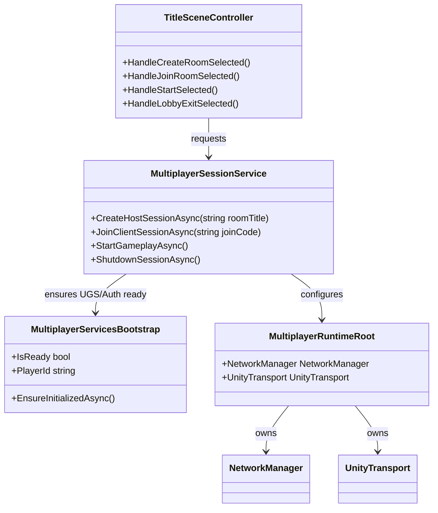
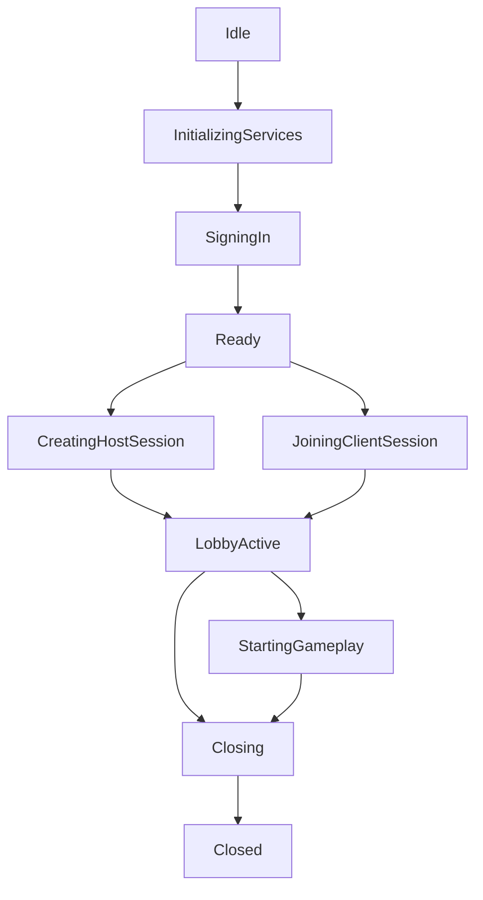

# 🔌 멀티플레이 패키지 및 서비스 초기화: Boss Raid Portfolio

이 문서는 `NGO / UTP / Relay / Lobby` 패키지 설치와 Unity Gaming Services 초기화 구조를 상세 정의한다.  
기준 설계는 `docs/technical/multiplayer/Multiplayer_Design.md`와 `docs/technical/multiplayer/Multiplayer_UI_Flow.md`를 따른다.  
이번 문서는 **패키지 기준선 + 서비스 초기화 + TitleScene 연결 지점 + 세션 정리 규칙**을 정확히 고정하기 위한 문서다.

---

## 1. 문서 목적 (Purpose)

이 문서는 아래 항목을 확정한다.

* Unity 2022 LTS 기준 멀티플레이 패키지 설치 기준
* UGS Project Link 선행 조건
* `UnityServices.InitializeAsync()`와 Authentication 초기화 순서
* `NetworkManager + UnityTransport` 배치 규칙
* Host / Client의 Lobby + Relay + NGO 시작 순서
* `TitleSceneController`와 멀티플레이 서비스 계층의 책임 분리
* 실패 / 취소 / Host 종료 시 strict cleanup 규칙
* 초기 구현 단계에서 Solo 흐름을 깨지 않는 분리 원칙

---

## 2. 기준 문서와 현재 기준선 (Reference & Current Baseline)

| 항목 | 현재 기준선 |
| --- | --- |
| 상위 설계 문서 | `docs/technical/multiplayer/Multiplayer_Design.md` |
| UI 기준 문서 | `docs/technical/multiplayer/Multiplayer_UI_Flow.md` |
| 현재 타이틀 상태 | `Assets/Scripts/Common/TitleSceneController.cs`가 멀티 UI 프로토타입만 제공한다. |
| 현재 패키지 상태 | `Packages/manifest.json`에는 `com.unity.services.core`만 있고, NGO/UTP/Relay/Lobby baseline은 아직 없다. |
| 현재 Project Link 상태 | `ProjectSettings/ProjectSettings.asset`의 `cloudProjectId`가 비어 있다. |
| 현재 멀티 로직 상태 | Host/Client/Lobby 흐름은 실제 서비스 호출 없이 로컬 UI 상태만 바꾼다. |

### 2.1. 현재 프로토타입 메모 (Prototype Note)

현재 `TitleSceneController`는 아래 동작을 실제 서비스 없이 로컬로 흉내 낸다.

* Host create 시 랜덤 join code 생성
* Client join 시 6자리 형식만 검사
* `2/2 connected` 상태를 실제 네트워크 연결 없이 로컬로 표시
* 2초 뒤 `Start`를 unlock

이 문서의 목적은 위 프로토타입을 **실제 Lobby / Relay / NGO 세션 시작 구조**로 교체할 정확한 기준을 만드는 것이다.

---

## 3. 목표와 비범위 (Goal & Non-Goal)

### 3.1. 목표 (Goal)

이번 단계의 목표는 아래와 같다.

1. Unity 프로젝트를 Lobby / Relay 사용 가능 상태로 만든다.
2. `TitleScene`에서 Host / Client가 실제 세션을 만들고 참가할 수 있게 한다.
3. 네트워크 런타임을 `UI orchestration`과 분리한다.
4. 세션 실패, 취소, Host 종료 시 항상 같은 정리 경로를 탄다.
5. 이후 2인 스폰 / 보스 aggro / spectator / retry consensus 구현의 기반을 만든다.

### 3.2. 이번 문서의 비범위 (Non-Goal)

이번 문서는 아래를 확정하지 않는다.

* 2인 gameplay spawn 구현 상세
* Boss aggro resolver 구현 상세
* spectator camera 구현 상세
* retry consensus 구현 상세
* dedicated server
* reconnect / host migration

---

## 4. 확정 기술 선택 (Locked Technical Choice)

### 4.1. 패키지 방향 (Package Direction)

Unity 2022 LTS 기준, 이 프로젝트는 **unified Multiplayer Services package + NGO** 조합을 사용한다.

| 영역 | 선택 |
| --- | --- |
| Lobby / Relay 서비스 SDK | `com.unity.services.multiplayer` |
| GameObject 네트워크 복제 | `com.unity.netcode.gameobjects` |
| 실제 전송 계층 | `UnityTransport` |
| 연결 방식 | Relay |
| 세션 모델 | Listen-Server / Host Authority |

### 4.2. 서비스 사용 방향 (Service Usage Direction)

이 프로젝트는 이번 단계에서 `LobbyService.Instance`와 `RelayService.Instance`를 직접 사용하는 방향으로 간다.

이유는 아래와 같다.

* 현재 디자인 문서는 `room title`, `join code`, `waiting lobby`, `strict close`를 명시적으로 제어한다.
* `TitleSceneController`는 UI 규칙이 이미 세분화되어 있다.
* direct Lobby/Relay service 계층은 실패 처리와 UI 문구 매핑을 더 명확하게 만든다.

### 4.3. Scene 관리 방향 (Scene Direction)

멀티플레이 세션이 `StartHost()` / `StartClient()` 이후에 시작되면, 이후 씬 전환은 장기적으로 NGO scene sync 기준으로 이동해야 한다.

Easy English rule:

`SceneManager.LoadScene` is okay for solo flow.  
After netcode session starts, host scene travel should use NGO scene sync.

---

## 5. 선행 조건 (Prerequisite)

### 5.1. Unity Dashboard 준비 (Dashboard Setup)

Host / Client 코드 구현 전에 Unity Dashboard에서 아래를 먼저 준비한다.

1. Unity Cloud project 생성
2. Multiplayer > Lobby 활성화
3. Multiplayer > Relay 활성화
4. 필요 시 billing / free tier 상태 확인

### 5.2. Editor Project Link (필수)

Unity Editor에서 아래를 완료해야 한다.

1. `Edit > Project Settings > Services`
2. `Use an existing Unity project ID`
3. Dashboard의 대상 프로젝트 연결

### 5.3. Project Link 완료 기준 (Done Condition)

아래 조건이 만족되어야 한다.

| 체크 | 완료 기준 |
| --- | --- |
| `cloudProjectId` | 비어 있지 않다 |
| Editor link | 대상 Dashboard project와 연결된다 |
| Lobby / Relay | 같은 Cloud project 안에서 활성화되어 있다 |

### 5.4. 현재 리포지토리 상태 메모 (Current Repo Note)

현재 저장소는 아직 Project Link가 없다.

* `ProjectSettings/ProjectSettings.asset`
* `cloudProjectId:`
* `cloudEnabled: 0`

즉, 이번 구현 전에는 **package 설치보다 먼저 Project Link를 완료해야 한다.**

---

## 6. 패키지 설치 기준 (Package Baseline)

### 6.1. 필수 패키지 (Required Package)

| 패키지 | 구분 | 목적 | 메모 |
| --- | --- | --- | --- |
| `com.unity.services.multiplayer` | Required | Lobby + Relay unified SDK baseline | Unity 2022 LTS 이상 권장 경로 |
| `com.unity.netcode.gameobjects` | Required | player object, NetworkVariable, RPC, scene sync | NGO baseline |
| `com.unity.services.core` | Existing | UGS core init | 현재 manifest에 이미 존재 |

### 6.2. 호환성 보조 패키지 (Compatibility Fallback)

기본적으로는 위 2개 package install을 우선한다.  
다만 에디터 해석/패키지 해상도 상태에 따라 아래 fallback을 허용한다.

| 패키지 | 사용 조건 |
| --- | --- |
| `com.unity.transport` | `UnityTransport` 컴포넌트가 resolver 후에도 보이지 않을 때만 명시 설치 |
| `com.unity.services.authentication` | `AuthenticationService` namespace가 resolver 후에도 명시적으로 잡히지 않을 때만 명시 설치 |

### 6.3. 금지 기준 (Do Not)

아래는 기본 경로로 사용하지 않는다.

* Unity 2022 LTS에서 `com.unity.services.lobby` + `com.unity.services.relay` standalone pair를 baseline으로 고정하지 않는다.
* unified package와 standalone package를 혼합 baseline으로 설계하지 않는다.
* 멀티플레이 구현 첫 단계에서 custom transport를 추가하지 않는다.

### 6.4. 설치 후 확인 포인트 (After Install Check)

설치 후 아래 항목을 확인한다.

1. `NetworkManager` 컴포넌트 추가 가능
2. `UnityTransport` 컴포넌트 추가 가능
3. `RelayService`, `LobbyService`, `AuthenticationService` namespace resolve 성공
4. Package resolve 이후 console compile error 없음

---

## 7. 런타임 구조 (Runtime Architecture)

### 7.1. 책임 분리 원칙 (Responsibility Split)

| 계층 | 책임 | 비고 |
| --- | --- | --- |
| `TitleSceneController` | 버튼 입력, 패널 전환, 문구 갱신, popup 제어 | UI only |
| `MultiplayerServicesBootstrap` | UGS init, anonymous sign-in, bootstrap state 보장 | one-time init |
| `MultiplayerSessionService` | create/join/leave lobby, relay setup, NGO start/stop | runtime authority |
| `MultiplayerRuntimeRoot` | persistent root, `NetworkManager`, `UnityTransport` 보유 | `DontDestroyOnLoad` |

### 7.2. 권장 클래스 구조 (Suggested Class Layout)



### 7.3. 배치 규칙 (Placement Rule)

권장 배치는 아래와 같다.

* `Assets/Scripts/Multiplayer/Bootstrap/MultiplayerServicesBootstrap.cs`
* `Assets/Scripts/Multiplayer/Services/MultiplayerSessionService.cs`
* `Assets/Scripts/Multiplayer/Runtime/MultiplayerRuntimeRoot.cs`

`TitleSceneController`에 직접 `LobbyService` / `RelayService` / `NetworkManager.StartHost()`를 넣지 않는다.

Easy English rule:

UI asks.  
Service layer does the real work.

---

## 8. 초기화 상태 머신 (Initialization State Machine)

### 8.1. 상태 정의 (State Definition)

| 상태 | 의미 |
| --- | --- |
| `Idle` | 아무것도 시작하지 않은 상태 |
| `InitializingServices` | `UnityServices.InitializeAsync()` 진행 중 |
| `SigningIn` | anonymous sign-in 진행 중 |
| `Ready` | 서비스 사용 준비 완료 |
| `CreatingHostSession` | Host create 흐름 진행 중 |
| `JoiningClientSession` | Client join 흐름 진행 중 |
| `LobbyActive` | lobby + relay + NGO가 살아 있는 대기 상태 |
| `StartingGameplay` | Host가 gameplay 시작 트리거 중 |
| `Closing` | 세션 정리 중 |
| `Closed` | 세션 정리 완료 |

### 8.2. 상태 전이 개요 (State Flow)



### 8.3. 중복 호출 규칙 (Re-entry Guard)

동시에 2개 이상의 create/join/close 요청을 처리하지 않는다.

예:

* Host create 중 `Back` 무시 금지 -> 대신 `Cancel requested`를 받아 정리 단계로 보낸다.
* Client join 중 다시 `Join` 누르기 금지
* close 중 `Start` 누르기 금지

---

## 9. 서비스 초기화 순서 (Services Initialization Order)

### 9.1. 고정 순서 (Fixed Order)

서비스 초기화 순서는 아래를 고정한다.

1. `UnityServices.InitializeAsync()`
2. `AuthenticationService.Instance.SignInAnonymouslyAsync()`
3. 로컬 `PlayerId` 확보
4. Host 또는 Client 세션 흐름 진입

### 9.2. 세부 규칙 (Detailed Rule)

* 이미 initialized 상태면 다시 초기화하지 않는다.
* 이미 signed-in 상태면 다시 sign-in 하지 않는다.
* init 또는 sign-in 예외가 발생하면 Lobby / Relay / NGO 단계로 가지 않는다.

### 9.3. 권장 의사코드 (Pseudo Flow)

```csharp
public async Task EnsureInitializedAsync()
{
    if (!_isInitialized)
    {
        await UnityServices.InitializeAsync();
        _isInitialized = true;
    }

    if (!AuthenticationService.Instance.IsSignedIn)
    {
        await AuthenticationService.Instance.SignInAnonymouslyAsync();
    }

    _playerId = AuthenticationService.Instance.PlayerId;
}
```

### 9.4. DSA 주의 메모 (Compliance Note)

Unity 문서 기준으로, Unity Authentication을 사용하는 UGS 서비스는 DSA notification 대응 고려가 필요하다.  
이번 단계에서는 **anonymous sign-in + gameplay bootstrap**을 먼저 구현하되, 배포 전에는 DSA notification 대응 여부를 별도 체크한다.

---

## 10. Host 생성 흐름 (Host Create Flow)

### 10.1. 핵심 결정 (Key Decision)

Host의 실제 create 순서는 아래를 사용한다.

1. Services/Auth ready
2. Relay allocation create
3. Relay join code get
4. Lobby create
5. Transport configure
6. NGO `StartHost()`
7. Lobby heartbeat / events start

### 10.2. 이 순서를 쓰는 이유 (Why This Order)

이 프로젝트는 Client가 `Relay join code`를 입력한다.  
따라서 Host는 Lobby를 만들기 전에 Relay join code를 먼저 확보하는 편이 더 단순하다.

장점:

* Lobby create 시점에 최종 metadata를 한 번에 넣을 수 있다.
* `CreateLobby -> UpdateLobby` 2단계 요청을 줄일 수 있다.
* Client query 기준값(`relayJoinCode`)이 즉시 확정된다.

### 10.3. Host 상세 순서 (Detailed Steps)

1. `EnsureInitializedAsync()`
2. `RelayService.Instance.CreateAllocationAsync(1)`
3. `RelayService.Instance.GetJoinCodeAsync(allocationId)`
4. `CreateLobbyAsync(roomTitle, 2, options)`
5. `UnityTransport.SetRelayServerData(...)`
6. `NetworkManager.StartHost()`
7. host heartbeat 시작
8. lobby events subscribe
9. `LobbyPanel` UI 갱신

### 10.4. Relay maxConnections 규칙 (Important)

플레이 총 인원은 2명이므로, Relay allocation의 `maxConnections`는 **1**이다.

설명:

* Host 자신은 이미 allocation owner다.
* 추가로 들어오는 remote player는 1명뿐이다.

### 10.5. 권장 connectionType (Transport Mode)

기본 connection type은 `dtls`로 고정한다.

| 타입 | 사용 방향 |
| --- | --- |
| `dtls` | 기본값. 인터넷 Host/Client 기본 경로 |
| `udp` | 로컬 디버그 또는 특수 호환 이슈가 있을 때만 fallback 검토 |
| `wss` | Web platform 필요 시에만 별도 검토 |

### 10.6. Host 시퀀스 (Sequence)

```mermaid
sequenceDiagram
    participant Title as TitleSceneController
    participant Boot as MultiplayerServicesBootstrap
    participant Session as MultiplayerSessionService
    participant Relay as Relay Service
    participant Lobby as Lobby Service
    participant Net as NetworkManager

    Title->>Session: CreateHostSessionAsync(roomTitle)
    Session->>Boot: EnsureInitializedAsync()
    Boot-->>Session: Ready + PlayerId
    Session->>Relay: CreateAllocationAsync(1)
    Relay-->>Session: Allocation
    Session->>Relay: GetJoinCodeAsync()
    Relay-->>Session: RelayJoinCode
    Session->>Lobby: CreateLobbyAsync(name, 2, data)
    Lobby-->>Session: Lobby
    Session->>Net: Configure UnityTransport
    Session->>Net: StartHost()
    Net-->>Session: Host started
    Session-->>Title: Lobby state + join code + 1/2
```

### 10.7. Host Lobby 데이터 계약 (Host Lobby Data Contract)

| 필드 | Visibility | Index | 값 |
| --- | --- | --- | --- |
| Lobby Name | Public | 기본 | room title |
| `RelayJoinCode` | Public | `S1` | Client input key와 같은 값 |
| `SessionState` | Public | 없음 | `Waiting`, `Starting`, `Closed` 중 하나 |
| `Mode` | Public | 없음 | `BossRaidCoop` |

`RelayJoinCode`는 query용이므로 indexed string field `S1`를 사용한다.

---

## 11. Client 참가 흐름 (Client Join Flow)

### 11.1. 핵심 결정 (Key Decision)

Client는 Lobby code가 아니라 **Relay join code**를 입력한다.  
따라서 구현은 `Lobby Join by Code`가 아니라 아래 경로를 사용한다.

1. input join code normalize
2. Lobby query by indexed `RelayJoinCode`
3. Lobby join by lobby ID
4. Relay join allocation by same code
5. NGO `StartClient()`

### 11.2. Client 상세 순서 (Detailed Steps)

1. `EnsureInitializedAsync()`
2. join code trim + uppercase
3. query lobby where `S1 == joinCode`
4. lobby not found -> wrong key popup
5. found -> `JoinLobbyByIdAsync(lobbyId, options)`
6. `RelayService.Instance.JoinAllocationAsync(joinCode)`
7. `UnityTransport.SetRelayServerData(...)`
8. `NetworkManager.StartClient()`
9. lobby events subscribe
10. `LobbyPanel` UI 갱신

### 11.3. 왜 Lobby Query가 필요한가 (Why Query First)

현재 UX는 `Relay join code`를 입력받고, same lobby panel에서 room title도 보여야 한다.

즉 Client는 아래 정보를 필요로 한다.

* room title
* 현재 player count
* host waiting state

이 정보는 Lobby metadata에서 읽는 편이 가장 단순하다.  
그래서 Client는 먼저 lobby를 찾고, 그 뒤 relay allocation에 참가한다.

### 11.4. Query 필터 규칙 (Query Filter Rule)

Client query는 최소 아래 조건을 사용한다.

* `AvailableSlots > 0`
* `S1 == inputJoinCode`

필요 시 `Mode == BossRaidCoop` 같은 보조 필드를 추가할 수 있다.

### 11.5. Client 시퀀스 (Sequence)

```mermaid
sequenceDiagram
    participant Title as TitleSceneController
    participant Boot as MultiplayerServicesBootstrap
    participant Session as MultiplayerSessionService
    participant Lobby as Lobby Service
    participant Relay as Relay Service
    participant Net as NetworkManager

    Title->>Session: JoinClientSessionAsync(joinCode)
    Session->>Boot: EnsureInitializedAsync()
    Boot-->>Session: Ready + PlayerId
    Session->>Lobby: QueryLobbiesAsync(S1 == joinCode)
    alt lobby not found
        Lobby-->>Session: empty
        Session-->>Title: Wrong key popup
    else found
        Lobby-->>Session: lobby
        Session->>Lobby: JoinLobbyByIdAsync(lobbyId)
        Session->>Relay: JoinAllocationAsync(joinCode)
        Relay-->>Session: JoinAllocation
        Session->>Net: Configure UnityTransport
        Session->>Net: StartClient()
        Net-->>Session: Client started
        Session-->>Title: Lobby state + room title + 2/2
    end
```

### 11.6. Wrong Key 처리 기준 (Wrong Key Rule)

아래는 모두 같은 UX로 묶는다.

* query 결과 없음
* relay join failed: invalid
* relay join failed: expired
* relay join failed: not found

표시 문구는 기존 문서를 유지한다.

```text
Wrong key. Please type again.
```

---

## 12. Lobby 유지 규칙 (Lobby Maintenance Rule)

### 12.1. Host heartbeat 규칙 (Heartbeat)

이번 단계는 direct Lobby API 경로를 사용하므로 Host는 heartbeat를 직접 보낸다.

규칙:

* Host only
* lobby active 동안 반복
* 권장 간격: `15s`

이유:

* Lobby 기본 active lifespan은 30초다.
* Host heartbeat가 없으면 inactive / cleanup 경로로 갈 수 있다.

### 12.2. Lobby events 구독 (Events)

Lobby state 반영은 `events 우선 + 필요 시 poll fallback` 구조를 사용한다.

이유:

* events는 효율적이다.
* 하지만 UI는 항상 마지막 확정 상태를 알아야 한다.
* 연결 흔들림이나 missed event 상황에서는 수동 refresh가 필요할 수 있다.

### 12.3. 업데이트 대상 (Observed Data)

`LobbyPanel`은 아래 값을 service layer에서 받아 표시한다.

| 값 | 의미 |
| --- | --- |
| `RoomTitle` | lobby name |
| `RelayJoinCode` | Host가 공유할 코드 |
| `ConnectedPlayers` | `1/2`, `2/2` |
| `LobbyStatus` | waiting / ready / starting |
| `IsHost` | Start 버튼 표시 여부 |
| `CanStart` | Start 버튼 interactable 여부 |

---

## 13. NetworkManager / UnityTransport 배치 규칙 (NGO Runtime Rule)

### 13.1. Runtime Root 규칙 (Persistent Root)

`NetworkManager`와 `UnityTransport`는 `TitleScene` 안의 임시 UI 오브젝트에 두지 않는다.

권장:

* 부트스트랩용 prefab 또는 runtime root
* `DontDestroyOnLoad`

### 13.2. 이유 (Why)

* Lobby 대기 중 네트워크 세션이 살아 있어야 한다.
* Host start 후 scene load가 들어와도 network runtime은 유지되어야 한다.
* gameplay scene에서 다시 `NetworkManager`를 생성하면 중복 인스턴스 리스크가 커진다.

### 13.3. NetworkManager 필수 설정 (Required Settings)

| 항목 | 기준 |
| --- | --- |
| Transport | `UnityTransport` |
| Scene Management | enabled 유지 권장 |
| Player Prefab | 후속 2P spawn 단계에서 확정 |
| DontDestroyOnLoad | runtime root 기준으로 유지 |

### 13.4. 금지 규칙 (Do Not)

* `TitleSceneController.Awake()`에서 바로 `StartHost()` / `StartClient()` 호출 금지
* `NetworkBehaviour.Awake()` 안에서 세션 시작 금지
* gameplay scene마다 새로운 `NetworkManager` 생성 금지

---

## 14. TitleScene 연결 지점 (TitleScene Integration Point)

### 14.1. 현재 교체 대상 메서드 (Current Replacement Point)

`Assets/Scripts/Common/TitleSceneController.cs`의 아래 메서드가 실제 서비스 계층 호출 지점이 된다.

| 현재 메서드 | 교체 방향 |
| --- | --- |
| `HandleCreateRoomSelected()` | `CreateHostSessionAsync()` 호출 |
| `HandleJoinRoomSelected()` | `JoinClientSessionAsync()` 호출 |
| `HandleStartSelected()` | 실제 `CanStart` 상태 확인 후 gameplay start 요청 |
| `HandleLobbyExitSelected()` | `ShutdownSessionAsync()` 호출 |

### 14.2. 현재 제거 대상 (Fake Logic To Remove)

아래 로컬 가짜 로직은 실제 구현 시 제거한다.

* `GenerateJoinCode(6)`
* `_connectedPlayerCount = 2` 직접 대입
* `_hostStartCountdownActive = true`를 실제 연결 없이 시작
* join code 형식만 보고 lobby 입장 성공 처리

### 14.3. 남길 수 있는 UI 규칙 (Keep Rule)

아래 UI 규칙은 유지한다.

* room title empty -> `join here 0000` 스타일 자동 제목
* wrong key popup 문구
* Host only Start button
* `2/2 connected` 상태가 안정적으로 2초 유지되면 Start unlock

### 14.4. Start unlock의 실제 기준 (Real Unlock Rule)

`CanStart`는 아래를 모두 만족할 때만 true가 된다.

1. current role is Host
2. lobby player count is exactly `2/2`
3. NGO client connection state is stable
4. 위 상태가 2초 유지됨

---

## 15. 게임 시작과 Scene 전환 메모 (Gameplay Start Note)

### 15.1. 이번 단계의 최소 기준 (Minimum Contract)

이번 문서 범위에서는 Host / Client lobby session까지를 중심으로 본다.  
다만 `Start` 이후 씬 전환 방향은 아래처럼 고정한다.

* Solo: 기존 `SceneLoader` 유지
* Multi: Host authority로 공통 scene load 시작

### 15.2. 중요한 제약 (Important Constraint)

멀티플레이 세션이 이미 시작된 뒤에는, local-only `SceneManager.LoadScene` 경로를 multiplayer main path로 쓰지 않는다.

Easy English rule:

If host and client are already in netcode session,  
scene load should be synchronized by NGO.

### 15.3. 현재 코드와의 관계 (Current Code Relation)

현재 `SceneLoader`와 `LoadingSceneController`는 solo 기준으로 동작한다.  
멀티플레이 gameplay start 단계에서는 이 흐름을 그대로 복사하지 말고, NGO scene sync와 연결되는 방식으로 재구성해야 한다.

---

## 16. 세션 정리 규칙 (Strict Cleanup)

### 16.1. 정리 원칙 (Cleanup Principle)

멀티플레이 세션 정리는 항상 아래 순서를 목표로 한다.

1. 추가 입력 차단
2. 이벤트 / 타이머 정지
3. Lobby leave 또는 delete
4. NGO shutdown
5. 로컬 상태 초기화
6. `TitleMainPanel` 복귀

### 16.2. Host 정리 규칙 (Host Close Rule)

Host는 아래를 수행한다.

* heartbeat 중지
* lobby events 해제
* lobby delete
* `NetworkManager.Shutdown()`
* local cached join code / room title / player count reset

### 16.3. Client 정리 규칙 (Client Close Rule)

Client는 아래를 수행한다.

* lobby events 해제
* leave lobby
* `NetworkManager.Shutdown()`
* local cached lobby data reset

### 16.4. 실패 지점별 처리 (Failure Mapping)

| 실패 지점 | 처리 |
| --- | --- |
| services init fail | popup or log 후 title 복귀 |
| auth fail | multiplayer flow 중단 후 title 복귀 |
| relay create fail | host create 중단 후 title 복귀 |
| lobby create fail | relay state 정리 후 title 복귀 |
| host start fail | lobby delete 후 title 복귀 |
| lobby query empty | wrong key popup 유지 |
| relay join fail | wrong key popup 또는 fail -> cleanup |
| client start fail | lobby leave 후 title 복귀 |
| host cancel | full cleanup 후 title 복귀 |
| host disconnect during gameplay | all peers session close 후 title 복귀 |

### 16.5. 예외 처리 우선순위 (Priority)

정리 중에는 새로운 network action보다 cleanup complete를 우선한다.

즉:

* close 중 `Join` 재시도 금지
* close 중 `Start` 금지
* close 중 UI panel swap만 먼저 하지 말고 service cleanup 완료를 기다린다

---

## 17. 런타임 데이터 계약 (Runtime Data Contract)

### 17.1. 세션 컨텍스트 (Session Context)

권장 런타임 컨텍스트는 아래 값을 가진다.

| 값 | 설명 |
| --- | --- |
| `LobbyId` | joined/created lobby id |
| `LobbyName` | room title |
| `RelayJoinCode` | client input key |
| `HostPlayerId` | host auth player id |
| `LocalPlayerId` | current auth player id |
| `CurrentRole` | `Host` or `Client` |
| `ConnectedPlayerCount` | current lobby member count |
| `SessionState` | `Waiting`, `Ready`, `Starting`, `Closing` |

### 17.2. UI 바인딩 계약 (UI Binding Contract)

`TitleSceneController`는 service layer에서 아래 값만 받도록 유지한다.

* `CurrentRoomTitle`
* `CurrentJoinCode`
* `ConnectedPlayerCount`
* `LobbyStatusText`
* `IsHost`
* `CanStart`
* `HasFatalError`
* `ShowWrongKeyPopup`

이 구조를 지키면 `TitleSceneController`는 UI orchestration 역할만 유지할 수 있다.

---

## 18. 구현 순서 권장안 (Recommended Implementation Order)

### 18.1. Step 1

Project Link + package install

완료 기준:

* `cloudProjectId` 세팅
* `com.unity.services.multiplayer` 추가
* `com.unity.netcode.gameobjects` 추가
* compile error 없음

### 18.2. Step 2

`MultiplayerRuntimeRoot` + `MultiplayerServicesBootstrap`

완료 기준:

* play mode에서 `UnityServices.InitializeAsync()` 성공
* anonymous sign-in 성공
* player id 로그 확인 가능

### 18.3. Step 3

Host create path

완료 기준:

* real relay join code 발급
* real lobby create 성공
* host network session 시작 성공

### 18.4. Step 4

Client join path

완료 기준:

* query by relay join code 성공
* lobby join 성공
* relay join 성공
* client network session 시작 성공

### 18.5. Step 5

Lobby state -> Title UI bind

완료 기준:

* `1/2`, `2/2` 표시 실제 값 반영
* host start unlock 2초 안정 게이트 반영
* wrong key popup 실서비스 결과와 연결

### 18.6. Step 6

strict cleanup

완료 기준:

* Back / Cancel / fail / host exit 시 local state와 remote session이 함께 정리된다

---

## 19. 검증 시나리오 (Verification Scenario)

### 19.1. Editor / Package 검증

1. Package Manager에서 required package 확인
2. `NetworkManager`와 `UnityTransport` 추가 가능 확인
3. compile error 없음

### 19.2. Service Init 검증

1. Play Mode 진입
2. UGS init 성공
3. anonymous sign-in 성공
4. player id 확보

### 19.3. Host 검증

1. Host create 클릭
2. room title 결정
3. relay join code 생성
4. lobby panel에 room title / join code / `1/2` 표시
5. host network started 확인

### 19.4. Client 검증

1. 잘못된 code 입력 -> wrong key popup
2. 올바른 code 입력 -> join 성공
3. host / client 둘 다 `2/2 connected` 표시
4. 2초 후 host start 가능

### 19.5. Cleanup 검증

1. Host cancel -> 둘 다 title 복귀
2. Client back -> host lobby `1/2` 반영 또는 strict close 기준에 맞는 종료 처리
3. Host app 종료 -> client도 세션 종료

---

## 20. 구현 메모 (Implementation Notes)

### 20.1. Join Code 검증 메모

UI는 기존처럼 `trim + uppercase + alphanumeric` 규칙을 먼저 적용할 수 있다.  
하지만 최종 진실 소스는 service 응답이다.

즉:

* local format check는 UX guard
* real validity는 Relay / Lobby 결과로 판단

### 20.2. Solo 보호 규칙

멀티플레이 bootstrap 코드는 `Solo Play`를 건드리지 않는다.

* solo start는 기존 `SceneLoader.Load(_nextSceneId)` 유지
* multiplayer path만 session service를 통한다

### 20.3. 로그 규칙

초기 구현 시 최소 아래 로그는 유지하는 편이 좋다.

* services init success/fail
* auth success/fail
* lobby create/join/leave/delete
* relay create/join
* host/client start success/fail
* cleanup start/complete

---

## 21. 외부 기준 참고 (Official Reference)

아래 Unity 공식 문서를 기준으로 이 문서를 작성했다.

* Relay get started: `https://docs.unity.com/relay/get-started`
* Relay with Netcode for GameObjects: `https://docs.unity.com/en-us/relay/relay-and-ngo`
* Authentication anonymous sign-in: `https://docs.unity.com/en-us/authentication/use-anon-sign-in`
* Authentication DSA notifications: `https://docs.unity.com/en-us/authentication/dsa-notifications`
* Lobby create: `https://docs.unity.com/ugs/en-us/manual/lobby/manual/create-a-lobby`
* Lobby join: `https://docs.unity.com/ugs/en-us/manual/lobby/manual/join-a-lobby`
* Lobby query: `https://docs.unity.com/ugs/en-us/manual/lobby/manual/query-for-lobbies`
* Lobby heartbeat: `https://docs.unity.com/ugs/en-us/manual/lobby/manual/heartbeat-a-lobby`
* Lobby events: `https://docs.unity.com/en-us/lobby/lobby-events`
* NGO scene management: `https://docs-multiplayer.unity3d.com/netcode/current/basics/scenemanagement/using-networkscenemanager/`

### 21.1. 작성 기준일 (Verification Date)

이 문서의 외부 기준 확인일은 `2026-03-13`이다.

---

## 22. 후속 연결 (Next Link)

이 문서 다음 구현 권장 순서는 아래와 같다.

1. package install + project link
2. runtime bootstrap 생성
3. Host create 구현
4. Client join 구현
5. Lobby UI 실제 데이터 바인딩
6. gameplay scene sync 연결


