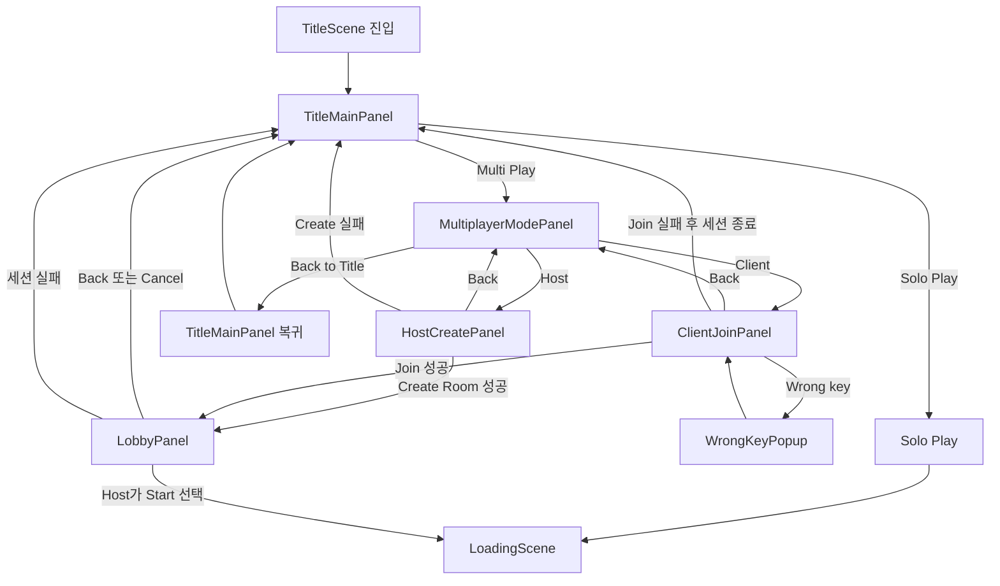
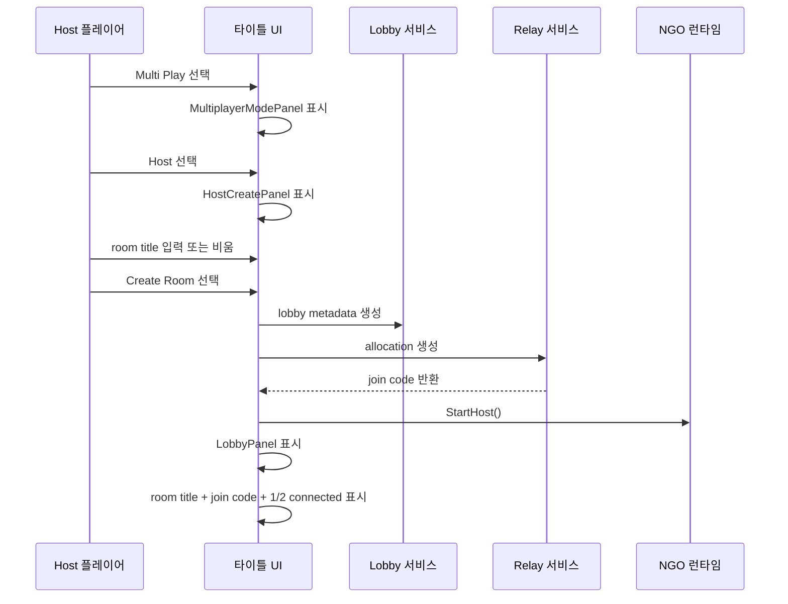
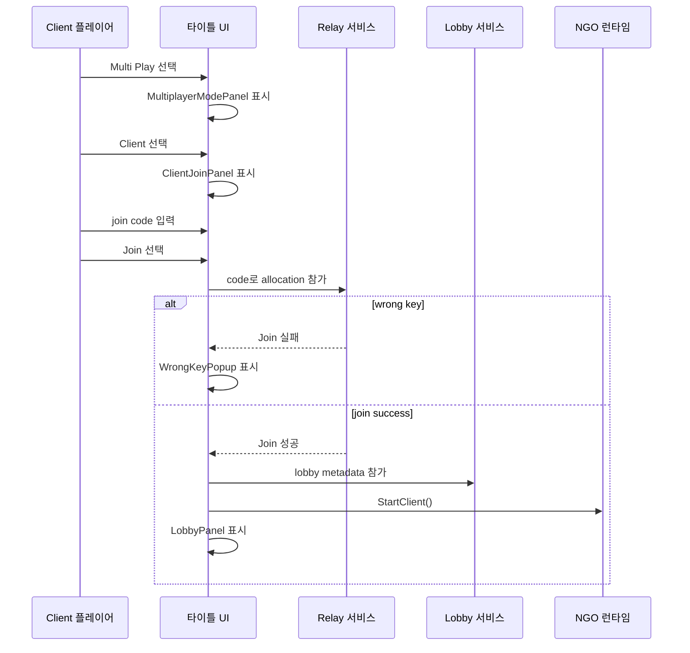
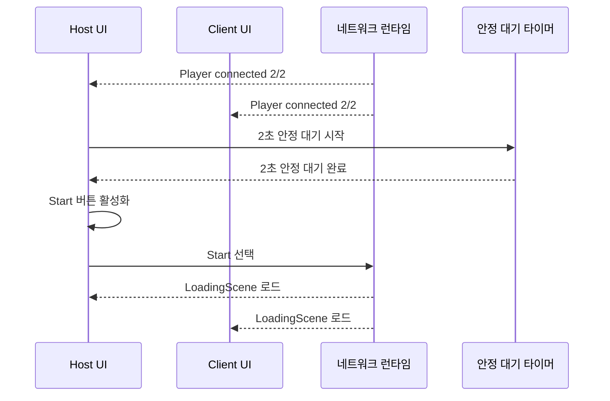

# 🧭 멀티플레이 UI 흐름: Boss Raid Portfolio

이 문서는 `TitleScene` 기반 멀티플레이 UI 구조와 패널 전환 흐름을 상세 정의한다.
기준 설계는 `docs/technical/multiplayer/Multiplayer_Design.md`를 따른다.
이 문서는 네트워크 런타임 구현 전에 UI 흐름과 화면 계약을 먼저 고정하기 위한 문서다.

---

## 1. 문서 목적 (Purpose)

이 문서는 아래 항목의 UI 기준 문서다.

* `TitleScene` 안의 멀티플레이 패널 구조
* `Solo / Multi / Host / Client / Lobby` 화면 전환
* Host 방 생성 흐름
* Client join code 입력 흐름
* 잘못된 join code popup 처리
* Lobby 대기 상태와 `Start` 활성화 규칙
* `Back / Cancel / Fail` 시 `TitleScene` 복귀 규칙

---

## 2. 기준 문서와 범위 (Reference & Scope)

| 항목 | 내용 |
| --- | --- |
| 상위 기준 문서 | `docs/technical/multiplayer/Multiplayer_Design.md` |
| UI 처리 위치 | `TitleScene` 내부 패널 확장 |
| 공용 씬 흐름 | `TitleScene -> LoadingScene -> GamePlayScene` |
| 이번 문서 범위 | 프리게임 UI 흐름만 다룬다. |
| 이번 문서 비포함 | 전투 HUD 동기화, spectator 카메라 UI, 결과 UI 세부 설계 |

### 2.1. 범위 메모 (Scope Note)

* 멀티플레이 UI는 새 씬을 추가하지 않는다.
* `LoadingScene`과 `GamePlayScene`은 기존 씬을 유지한다.
* 이 문서는 `TitleScene`의 화면 구조와 전환 규칙에 집중한다.

---

## 3. UI 구조 개요 (UI Structure Overview)

`TitleScene`은 멀티플레이 진입 시 여러 패널을 교체 표시한다.
기본 원칙은 `주요 패널 1개 활성 + 오버레이 팝업만 예외 허용`이다.

### 3.1. 주요 패널 목록 (Panel List)

| 패널 | 역할 | 기본 표시 상태 | 종료 조건 |
| --- | --- | --- | --- |
| `TitleMainPanel` | 메인 시작 화면 | 기본 표시 | `Multi Play` 또는 `Solo Play` 선택 |
| `MultiplayerModePanel` | Host/Client 분기 선택 | `Multi Play` 진입 후 표시 | `Host`, `Client`, `Back to Title` |
| `HostCreatePanel` | Host 방 생성 입력 | `Host` 선택 후 표시 | `Create Room` 또는 `Back` |
| `ClientJoinPanel` | Client join code 입력 | `Client` 선택 후 표시 | `Join` 또는 `Back` |
| `WrongKeyPopup` | 잘못된 join code 안내 | 기본 비표시 | `OK` 입력 시 닫힘 |
| `LobbyPanel` | 공통 대기 패널 | Host 생성 / Client 입장 성공 후 표시 | `Start`, `Back`, `Cancel`, 실패 |

### 3.2. 레이아웃 원칙 (Layout Rule)

1. `TitleMainPanel`은 첫 진입 패널이다.
2. `MultiplayerModePanel`은 Host/Client 분기 선택 패널이다.
3. `HostCreatePanel`과 `ClientJoinPanel`은 입력용 패널이다.
4. `LobbyPanel`은 Host와 Client가 함께 보는 공통 대기 패널이다.
5. `WrongKeyPopup`은 이번 범위에서 유일한 오버레이 팝업이다.

---

## 4. 메인 UI 흐름 (Main UI Flow)

### 4.1. 쉬운 흐름 설명 (Simple Flow)

1. `TitleScene`에 진입한다.
2. `TitleMainPanel`을 표시한다.
3. 플레이어가 `Multi Play`를 선택하면 `MultiplayerModePanel`을 표시한다.
4. 플레이어가 `Host`를 선택하면 `HostCreatePanel`을 표시한다.
5. 플레이어가 `Client`를 선택하면 `ClientJoinPanel`을 표시한다.
6. 방 생성 또는 Join이 성공하면 `LobbyPanel`을 표시한다.
7. 두 플레이어가 2초 동안 연결 상태를 유지하면 Host의 `Start`를 활성화한다.
8. Host가 `Start`를 누르면 `LoadingScene`으로 이동한다.

---

## 5. 패널별 상세 규칙 (Panel Detail Rules)

### 5.1. `TitleMainPanel`

| 요소 | 규칙 |
| --- | --- |
| `Solo Play` button | 기존 싱글플레이 흐름으로 진입한다. |
| `Multi Play` button | `MultiplayerModePanel`로 이동한다. |
| old `press any key` UX | 사용하지 않는다. |

### 5.2. `MultiplayerModePanel`

| 요소 | 규칙 |
| --- | --- |
| `Host` button | `HostCreatePanel`을 연다. |
| `Client` button | `ClientJoinPanel`을 연다. |
| `Back to Title` button | `TitleMainPanel`로 복귀한다. |

### 5.3. `HostCreatePanel`

| 요소 | 규칙 |
| --- | --- |
| room title 입력 | 선택 입력이다. |
| 빈 제목 | 자동 제목 `join here 0000` 을 생성한다. |
| `Create Room` button | Lobby + Relay 생성 요청을 시작한다. |
| `Back` button | `MultiplayerModePanel`로 복귀한다. |

### 5.4. `ClientJoinPanel`

| 요소 | 규칙 |
| --- | --- |
| join code 입력 | Relay join code를 입력한다. |
| `Join` button | join 요청을 시작한다. |
| 잘못된 key | `WrongKeyPopup`을 띄우고 입력 패널로 돌아온다. |
| `Back` button | `MultiplayerModePanel`로 복귀한다. |

### 5.5. `WrongKeyPopup`

| 요소 | 규칙 |
| --- | --- |
| 메시지 | 기본 문구는 `Wrong key. Please type again.` |
| `OK` button | popup만 닫고 `ClientJoinPanel` 상태는 유지한다. |
| overlay 방식 | 하위 패널 상태를 지우지 않고 popup만 띄운다. |

### 5.6. `LobbyPanel`

| 요소 | 규칙 |
| --- | --- |
| room title | 항상 표시한다. |
| join code | Host 생성 직후 즉시 표시한다. |
| 연결 인원 | `1/2`, `2/2` 상태를 표시한다. |
| 대기 문구 | 연결 상태에 맞는 안내를 표시한다. |
| `Start` button | Host만 볼 수 있다. |
| `Start` 활성 조건 | `2/2 connected` 상태가 2초 유지되면 활성화된다. |
| `Back/Cancel` | 세션 종료 후 `TitleMainPanel`로 복귀한다. |

---

## 6. 세부 플로우 (Detailed Flow)

### 6.1. Host 생성 흐름 (Host Create Flow)

Host 흐름 규칙:

1. Host는 room title을 입력하거나 비워 둘 수 있다.
2. UI는 먼저 room metadata를 만든다.
3. UI는 Relay join code를 받는다.
4. UI는 host 네트워크 런타임을 시작한다.
5. UI는 `LobbyPanel`로 이동한다.

### 6.2. Client 참가 흐름 (Client Join Flow)

Client 흐름 규칙:

1. Client는 relay join code를 입력한다.
2. code가 잘못되면 popup을 띄운다.
3. Join이 성공하면 공통 lobby UI로 들어간다.
4. Client는 `Start` 권한을 가지지 않는다.

### 6.3. Lobby 준비 흐름 (Lobby Ready Flow)

Lobby 준비 규칙:

1. `2/2 connected`를 표시한다.
2. 2초 동안 안정 상태를 기다린다.
3. Host의 `Start`를 활성화한다.
4. Host가 모든 플레이어의 gameplay 흐름을 시작한다.

### 6.4. Back / Cancel / Fail Flow

1. Host가 `Back` 또는 `Cancel`을 누르면 세션을 닫고 `TitleMainPanel`로 돌아간다.
2. create, join, start 중 하나라도 실패하면 세션을 닫고 `TitleMainPanel`로 돌아간다.
3. Host가 나간 뒤 Client만 lobby에 남아 있지 않는다.
4. 이번 버전은 reconnect를 지원하지 않는다.

---

## 7. UI 전환 표 (Transition Table)

| 현재 UI | 트리거 | 다음 UI | 메모 |
| --- | --- | --- | --- |
| `TitleMainPanel` | `Solo Play` | `LoadingScene` | 솔로 시작 흐름 |
| `TitleMainPanel` | `Multi Play` | `MultiplayerModePanel` | 멀티플레이 진입 |
| `MultiplayerModePanel` | `Host` | `HostCreatePanel` | Host 생성 진입 |
| `MultiplayerModePanel` | `Client` | `ClientJoinPanel` | Client 참가 진입 |
| `MultiplayerModePanel` | `Back to Title` | `TitleMainPanel` | 로컬 뒤로 가기 |
| `HostCreatePanel` | `Create Room success` | `LobbyPanel` | Host lobby 진입 |
| `HostCreatePanel` | `Back` | `MultiplayerModePanel` | 로컬 뒤로 가기 |
| `HostCreatePanel` | `Create fail` | `TitleMainPanel` | 즉시 세션 종료 |
| `ClientJoinPanel` | `Join success` | `LobbyPanel` | 공통 lobby 진입 |
| `ClientJoinPanel` | `Wrong key` | `WrongKeyPopup` | 오버레이 팝업 |
| `WrongKeyPopup` | `OK` | `ClientJoinPanel` | 가능하면 입력 상태 유지 |
| `ClientJoinPanel` | `Back` | `MultiplayerModePanel` | 로컬 뒤로 가기 |
| `ClientJoinPanel` | `Join fail` | `TitleMainPanel` | 즉시 세션 종료 |
| `LobbyPanel` | `Back/Cancel` | `TitleMainPanel` | 세션 종료 |
| `LobbyPanel` | `Session fail` | `TitleMainPanel` | 세션 종료 |
| `LobbyPanel` | `Host Start` | `LoadingScene` | 동기화된 로드 |

---

## 8. UI 상태 계약 (UI State Contract)

### 8.1. 표시 규칙 (Visibility Rule)

* 같은 시점에는 주요 패널 하나만 활성화한다.
* `WrongKeyPopup`만 overlay 예외로 허용한다.
* `LobbyPanel`에서는 `room title`을 항상 보여 준다.
* `ClientJoinPanel`에서는 join 입력창과 lobby 정보 미리보기를 함께 둘 수 있다.

### 8.2. 상호작용 규칙 (Interaction Rule)

* Client는 `Start` 버튼을 보지 않는다.
* Host는 `2/2 connected` 상태가 2초 유지되기 전에는 `Start`를 누를 수 없다.
* `Back` 계열 버튼은 로컬 화면만 닫지 않고 세션 정리 규칙을 따라야 한다.
* 잘못된 key UX는 `invalid`, `expired`, `not found`를 같은 popup으로 처리한다.

### 8.3. 텍스트 계약 (Text Contract)

| 상황 | 문구 |
| --- | --- |
| 잘못된 key | `Wrong key. Please type again.` |
| lobby 대기 | `Waiting for other player...` |
| 연결 완료 | `2/2 connected` |
| 시작 가능 | `Ready to start` |

---

## 9. 구현 연결 메모 (Implementation Notes)

* 이 문서는 `TitleScene` UI 구조 설계 문서다.
* 실제 서비스 호출은 UI가 직접 모든 로직을 가지지 않고, 별도 멀티플레이 bootstrap / lobby / relay 계층으로 위임하는 방향이 바람직하다.
* `TitleSceneController`는 화면 전환 오케스트레이션의 진입점이 될 수 있다.
* `SceneLoader`는 멀티플레이에서 Host 주도 씬 이동 규칙을 따라야 한다.
* UI 문서 확정 후, 다음 단계는 패키지 및 서비스 초기화다.

---

## 10. 후속 작업 연결 (Next Link)

이 문서 확정 후 권장 순서는 아래와 같다.

1. `TitleScene` 패널 계층과 오브젝트 네이밍 확정
2. `TitleSceneController` 책임 분리안 정리
3. Lobby/Relay 서비스 초기화 진입점 정의
4. Host/Client create/join 구현 시작
